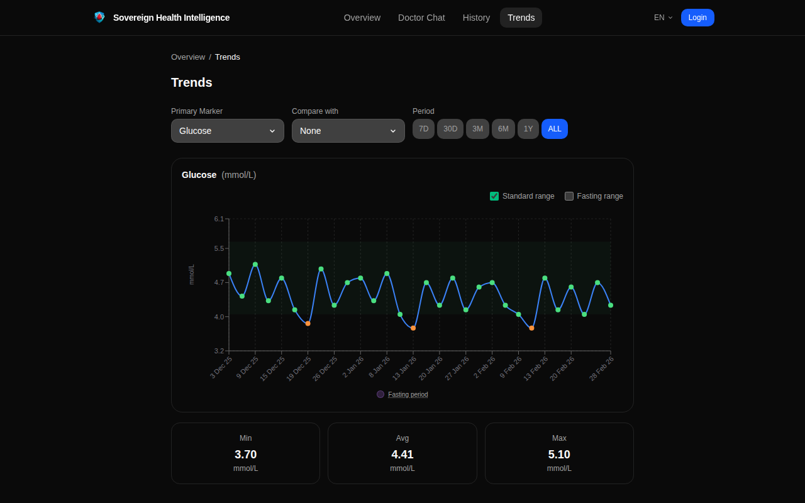

<p align="center">
  
</p>

<h1 align="center">BrickOS</h1>

<p align="center">
  <strong>Building sovereignty, brick by brick.</strong><br />
  A sovereign software platform for people who want control over their lives.
</p>

<p align="center">
  <a href="LICENSE"></a>
  
  
  
  
  <a href="https://app.sovereignhealth.io"></a>
</p>

---

## What is BrickOS?

BrickOS is a modular platform for building sovereign applications -- software where users own their data and choose where it runs. Cloud SaaS with a self-hosted escape hatch: every app can run on your own hardware via Docker, StartOS, or Tor.

Your most sensitive data -- health records, financial history, personal communications -- shouldn't live on servers you don't control.

> Inspired by [*Brick by Brick*](https://www.amazon.com/Brick-LEGO-Rewrote-Innovation-Industry/dp/0307951618) -- the story of how LEGO rebuilt itself through modular, composable systems. BrickOS applies the same philosophy to sovereign software: each app is a brick, independent but stronger together.

### The 7 Pillars of Sovereign Life

Sovereignty is not one thing. It is a stack of capabilities -- each a brick in a self-reliant life.

```
  ┌──────────┐ ┌──────────┐ ┌──────────┐ ┌──────────┐ ┌──────────┐
  │ FINANCE  │ │  HEALTH  │ │   DATA   │ │ATTENTION │ │  ENERGY  │
  │          │ │          │ │          │ │          │ │          │
  │ Exchange │ │ Sov.     │ │ Proposal │ │ Signal   │ │ Almanac  │
  │ BTC Track│ │ Health   │ │ Platform │ │ BitChat  │ │ Survival │
  │ Vote     │ │          │ │          │ │          │ │ Guides   │
  │ Cashu    │ │          │ │          │ │          │ │          │
  └────┬─────┘ └────┬─────┘ └────┬─────┘ └────┬─────┘ └────┬─────┘
       └─────────────┴────────────┴─────────────┴────────────┘
  ┌──────────────────────────────────────────────────────────────┐
  │          TECHNOLOGY & PRIVACY  (Foundation Layer)            │
  │   Identity -- Link -- NOSTR -- Tor -- TollGate -- Zapstore  │
  ├──────────────────────────────────────────────────────────────┤
  │          FAMILY & COMMUNITY  (Social Layer)                 │
  │   Trust Scores -- Governance -- Mutual Aid -- Escrow        │
  └──────────────────────────────────────────────────────────────┘
```

| Pillar | Question it answers | Apps |
|--------|-------------------|------|
| **Finance** | Can I transact, save, and trade without banks? | Sovereign Exchange, BTC Tracker, Sovereign Vote, Cashu Mint |
| **Health** | Can I own and access my medical data? | Sovereign Health Intelligence |
| **Data** | Can I govern information without centralized platforms? | Sovereign Proposal Platform |
| **Attention** | Can I communicate without surveillance? | Sovereign Signal |
| **Energy** | Can I sustain myself with knowledge and resources? | Sovereign Almanac |
| **Technology & Privacy** | Is my infrastructure sovereign? | Sovereign Identity, Sovereign Link, NOSTR Relay, TollGate, Zapstore |
| **Family & Community** | Can we organize, trust, and help each other? | Trust Scores, Escrow, Governance |

### Principles

- **Sovereign-first** -- You own your data, your identity, your keys. Export it, self-host it, delete it. No vendor lock-in.
- **Brick architecture** -- Modular apps composed from shared platform crates. Each "brick" is independent but stronger together.
- **Daily-use first, emergency-ready by design** -- Apps people use every day that keep working when centralized systems fail.
- **Privacy by design** -- AES-256-GCM encryption at rest, Row-Level Security, Cashu ecash for private payments. Zero third-party tracking.
- **Self-hostable** -- Docker-based. Runs on a VPS, Raspberry Pi via Start9, or your laptop.
- **Local-first** -- Apps read/write locally first. Remote sync is an optimization, not a requirement.
- **Open source** -- AGPL-3.0 licensed. Read the code, audit the security, fork it.

## Products

| Product | Pillar | Status |
|---------|--------|--------|
| [**Sovereign Health Intelligence**](apps/health/sovereign-health/) | Health | **Live** -- [app.sovereignhealth.io](https://app.sovereignhealth.io) |
| [**Sovereign Link**](apps/infrastructure/sovereign-link/) | Technology | **Live** -- URL shortener + QR codes |
| **BTC Tracker** | Finance | In progress |
| **Sovereign Proposal Platform** | Data | Planned -- NOSTR-native governance, Bitcoin-anchored |
| **Sovereign Exchange** | Finance | Planned -- P2P marketplace, barter + Bitcoin + Cashu |
| **Sovereign Signal** | Attention | Planned -- Encrypted comms via NOSTR + BitChat mesh |
| **Sovereign Almanac** | Energy | Planned -- Offline-first survival and life knowledge base |
| **Sovereign Identity** | Technology | Planned -- NOSTR + Bitcoin identity, SSO, trust scores |

### Sovereign Health Intelligence

Personal health data platform for biomarker tracking. Import lab PDFs, track 100+ biomarkers across 8 health zones, get AI-powered insights from Dr. Alex.

<p align="center">
  
  
</p>
<p align="center">
  
  
</p>

## Roadmap

| Phase | Focus | Milestone |
|-------|-------|-----------|
| **Foundation** | Sovereign Identity, NOSTR keypair management, trust score engine, SSO | Identity layer operational |
| **Data** | Sovereign Proposal Platform -- NOSTR relay, deliberative consensus | SPP live for protocol governance |
| **Finance (Barter)** | Sovereign Exchange -- local-first listings, barter trades, reputation | P2P marketplace |
| **Finance (Bitcoin)** | Lightning + Cashu mint, 2-of-3 escrow, dispute resolution | Bitcoin + ecash marketplace |
| **Attention** | Sovereign Signal -- NOSTR DMs, groups, BitChat mesh, dead man's switch | Censorship-resistant comms |
| **Energy** | Sovereign Almanac -- survival content (EN + DE), offline cache, community wiki | Knowledge on every device |
| **Resilience** | TollGate WiFi, Zapstore distribution, mesh gossip, Grab Bag, Tor-only mode | Works at all connectivity levels |

See [docs/design/001-sovereign-stack-vision.md](docs/design/001-sovereign-stack-vision.md) for the full design.

## Quick Start

```bash
git clone https://github.com/sovereignbrick/brickos.git
cd brickos/apps/health/sovereign-health/ops
docker compose -f docker-compose.dev.yml up -d
```

Then open [http://localhost:3000](http://localhost:3000).

For development setup, see individual README files in each app directory.

## Architecture

```
brickos/
├── apps/
│   ├── health/                      HEALTH PILLAR
│   │   └── sovereign-health/        Sovereign Health Intelligence
│   │       ├── api/                 Rust Actix-web backend
│   │       ├── frontend/            Next.js 16 PWA
│   │       ├── website/             Marketing website
│   │       └── ops/                 Deploy scripts, Docker configs
│   ├── finance/                     FINANCE PILLAR
│   │   └── btc-tracker/             BTC portfolio tracking
│   ├── infrastructure/              TECHNOLOGY & PRIVACY PILLAR
│   │   └── sovereign-link/          URL shortener + affiliate links
│   ├── data/ (planned)              DATA PILLAR
│   ├── attention/ (planned)         ATTENTION PILLAR
│   ├── energy/ (planned)            ENERGY PILLAR
│   └── governance/ (planned)        GOVERNANCE
│
├── crates/                          Shared Rust libraries
│   ├── brickos-auth/                JWT, MFA, session management
│   ├── brickos-crypto/              AES-256-GCM encryption at rest
│   ├── brickos-db/                  Database pool, migrations
│   ├── brickos-billing/             Stripe + BTC Lightning payments
│   ├── brickos-email/               Transactional email (Mailgun)
│   ├── brickos-backup/              Backup gateway service
│   ├── brickos-startos/             Start9 integration
│   ├── brickos-nostr/ (planned)     NOSTR protocol core
│   ├── brickos-identity/ (planned)  NOSTR + BTC identity, SSO
│   ├── brickos-trust/ (planned)     Trust score engine
│   ├── brickos-escrow/ (planned)    Multisig + Cashu P2PK escrow
│   └── brickos-mint/ (planned)      Cashu mint (wraps CDK)
│
├── packages/                        Shared Node packages
│   ├── ui/                          @brickos/ui component library
│   └── tokens/                      @brickos/tokens design tokens
│
└── docs/                            Platform documentation
    ├── design/                      Numbered design documents (001-004)
    ├── tracker/                     Local-first issue tracker
    └── screenshots/                 App screenshots + demo GIF
```

## Tech Stack

| Layer | Technology |
|-------|-----------|
| **Backend** | Rust, Actix-web 4, SQLx 0.8 |
| **Frontend** | Next.js 16, React 19, Tailwind CSS 4, shadcn/ui |
| **Database** | PostgreSQL 16 (pgAudit, Row-Level Security, field-level encryption) |
| **AI** | Anthropic Claude API (Dr. Alex health assistant) |
| **Payments** | Stripe + Strike (Bitcoin Lightning) + Cashu ecash (planned) |
| **PWA** | Serwist (service worker), IndexedDB (offline write queue), Web Push |
| **Infrastructure** | Docker, Hetzner VPS, Cloudflare CDN/DNS/WAF |
| **Monitoring** | Gatus (uptime), ntfy (alerts), in-app API metrics dashboard |

## Distribution

| Target | Status | Notes |
|--------|--------|-------|
| **Cloud SaaS** | Live | Docker on Hetzner VPS, Cloudflare CDN |
| **PWA** | Live | Installable, offline-first, push notifications, background sync |
| **Tor** | Live | `.onion` hidden service for censorship-resistant access |
| **Start9** | Planned | Self-hosted on personal hardware |
| **Flatpak** | Planned | Linux desktop app |
| **Zapstore** | Planned | NOSTR-based censorship-resistant app distribution |
| **Mesh/BitChat** | Planned | Local-only mode when internet is unavailable |

## Security & Privacy

- **Encryption at rest** -- AES-256-GCM for all health measurements
- **Row-Level Security** -- PostgreSQL RLS policies on all user data tables
- **pgAudit** -- Database-level audit logging for all write operations
- **DB audit triggers** -- Application-level audit trail with changed fields
- **DSGVO/GDPR** -- Data export (Art. 20), deletion cascade (Art. 17), consent management (Art. 7), access logs (Art. 15)
- **IP hashing** -- SHA-256 pseudonymization in audit logs
- **No tracking** -- Zero third-party analytics, no ad networks

## Network Degradation

BrickOS works across all connectivity levels -- no "emergency switch," just graceful degradation.

| Level | Connectivity | BrickOS Capability |
|-------|-------------|-------------------|
| **0: Normal** | Full clearnet | All features, cross-border marketplace, Lightning + Cashu |
| **1: Surveilled** | Tor-routed | Full features, privacy-preserved |
| **2: Restricted** | Satellite / intermittent | Core features, text-only marketplace, async messaging |
| **3: Local only** | Mesh / BitChat / TollGate | Local marketplace, mesh messaging, cached Almanac |
| **4: Offline** | Sneakernet (USB/NFC) | Grab Bag identity, cached knowledge, bearer Cashu tokens |

## Contributing

See [CONTRIBUTING.md](CONTRIBUTING.md) for guidelines.

## License

[AGPL-3.0](LICENSE) -- Open source core. Commercial licenses available for organizations needing proprietary modifications.

## Links

- **App:** [app.sovereignhealth.io](https://app.sovereignhealth.io) -- free registration with a free license
- **Website:** [sovereignhealth.io](https://sovereignhealth.io)
- **Platform:** [brickos.io](https://brickos.io)

---

*Building sovereignty, [brick by brick](https://www.amazon.com/Brick-LEGO-Rewrote-Innovation-Industry/dp/0307951618).*
