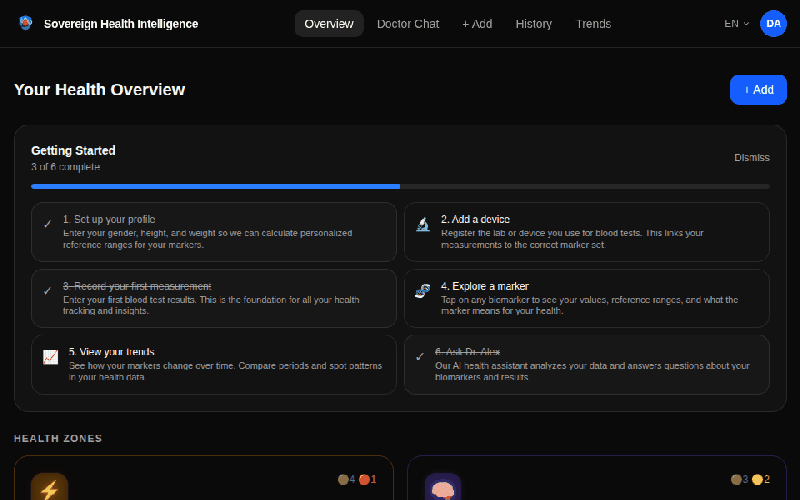
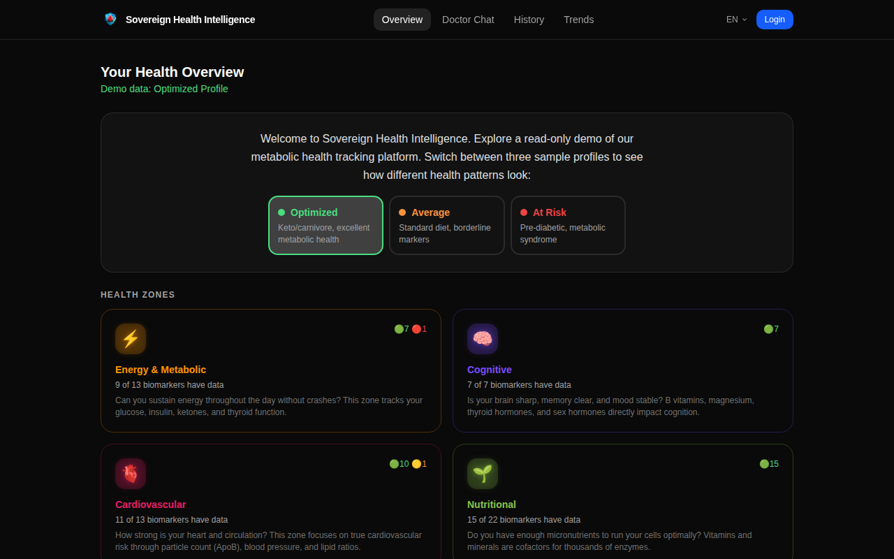
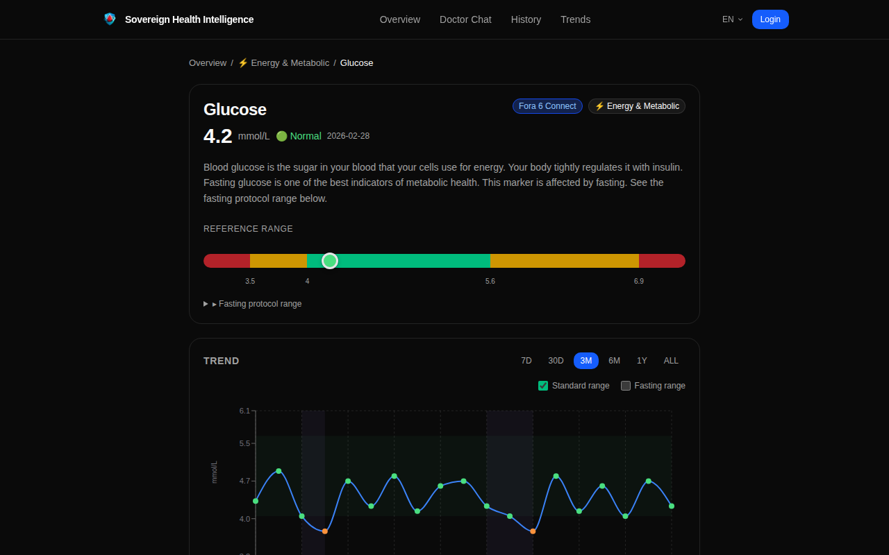
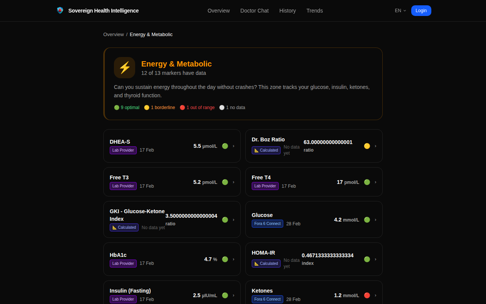
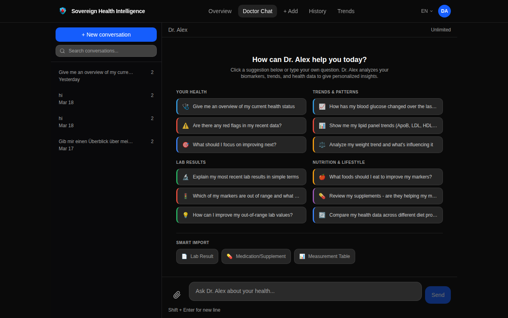

# Sovereign Health Intelligence

<p align="center">
  
</p>

<p align="center">
  <strong>Your health data belongs to you -- not your lab, not your doctor's portal, not a cloud provider.</strong>
</p>

<p align="center">
  <a href="https://app.sovereignhealth.io"></a>
  <a href="https://demo.sovereignhealth.io"></a>
  
</p>

---

## The Problem

Your health data is trapped in silos: lab results locked in proprietary portals, PDFs emailed to you that no app can read, wearable data in vendor clouds you can't export from. You generated this data with your own blood -- but you can't combine, analyze, or even reliably access it.

## The Solution

Sovereign Health imports, normalizes, and unifies your health data into a single platform you control.

```
Lab PDF ──────┐
Smart scale ──┤                        ┌── Biomarker Dashboard (8 health zones)
Glucose meter ┼──► AI Import + Parse ──┼── Trend Analysis (protocol-aware)
Manual entry ─┤        │               ├── Dr. Alex AI Chat (personalized insights)
Old records ──┘        ▼               └── Data Export (JSON / CSV / PDF)
              Normalized Markers
              (AES-256-GCM encrypted)
```

## Features

| Feature | Description |
|---------|-------------|
| **AI Lab Import** | Upload a lab PDF or photo -- AI extracts, matches, and normalizes 100+ biomarkers |
| **Biomarker Dashboard** | 8 health zones with color-coded status (green/orange/red) and protocol-aware reference ranges |
| **Dr. Alex AI Chat** | Health assistant that analyzes YOUR data -- trends, red flags, nutrition advice |
| **Trend Charts** | Track any marker over time with fasting vs standard range overlays |
| **Calculated Markers** | Auto-computed ratios: GKI, BMI, HOMA-IR, WHtR, TG/HDL, Dr. Boz |
| **Smart Import** | Format auto-detection, fuzzy marker matching, physiological validation, user corrections feed global learning |
| **Unit Preferences** | Choose your units (mmol/L vs mg/dL, kg vs lbs) -- values convert throughout the app |
| **Data Export** | JSON, CSV, PDF reports -- your data, your format, zero lock-in |
| **PWA** | Install on phone/desktop, works offline, push notifications, background sync |
| **Multi-language** | Full i18n in English + German |

<p align="center">
  
  
</p>
<p align="center">
  
  
</p>

## Data Sovereignty

- **Encryption at rest** -- AES-256-GCM for all health measurements
- **Row-Level Security** -- PostgreSQL RLS ensures users can only access their own data
- **DB audit trail** -- Every INSERT/UPDATE/DELETE logged with changed fields
- **Self-hostable** -- Run on your own VPS, Start9, or local Docker
- **DSGVO/GDPR** -- Data export (Art. 20), account deletion (Art. 17), consent management (Art. 7), access logs (Art. 15)
- **No tracking** -- Zero third-party analytics, no ad networks, no data selling
- **Open source** -- AGPL-3.0, audit every line

## Structure

```
sovereign-health/
├── api/            Rust Actix-web backend (v0.33.0)
│   ├── migrations/ 100+ SQL migrations (pgAudit, RLS, encryption)
│   ├── src/        Handlers, services, middleware
│   └── tests/      Smoke, integration, snapshot, property-based
├── frontend/       Next.js 16 PWA
│   ├── src/app/    App router pages
│   ├── src/lib/    API client, auth, theme, i18n, units
│   └── src/hooks/  Custom hooks (unit preferences, etc.)
├── website/        Marketing site (sovereignhealth.io)
├── ops/            Deploy scripts, Docker compose, nginx
└── docs/           Design docs, sprint planning, releases
```

## Quick Start

```bash
cd apps/health/sovereign-health/ops
cp ../api/.env.example ../api/.env    # Configure DB, JWT secret, API keys
docker compose -f docker-compose.dev.yml up -d
```

Open [http://localhost:3000](http://localhost:3000).

## Tiers

| Tier | Price | Markers | AI | Key Features |
|------|-------|---------|-----|-------------|
| **Glimpse** | Free | 8 | 5/mo | Dashboard, basic tracking |
| **Focus** | 9.99/mo | 20 | 15/mo | CSV export, custom ranges |
| **Insight** | 24.99/mo | 50 | 50/mo | Lab import, trends, PDF reports |
| **Clarity** | 49.99/mo | All | Unlimited | Team sharing, benchmarks |
| **Horizon** | 99.99/mo | All | Unlimited | API access, priority support |
| **Core** | Free (AGPL) | All | All | Self-hosted, full access |

## Links

- **App:** [app.sovereignhealth.io](https://app.sovereignhealth.io)
- **Demo:** [demo.sovereignhealth.io](https://demo.sovereignhealth.io) (3 sample profiles, no signup needed)
- **Website:** [sovereignhealth.io](https://sovereignhealth.io)
- **Platform:** [brickos.io](https://brickos.io)

## License

[AGPL-3.0](../../../LICENSE)
