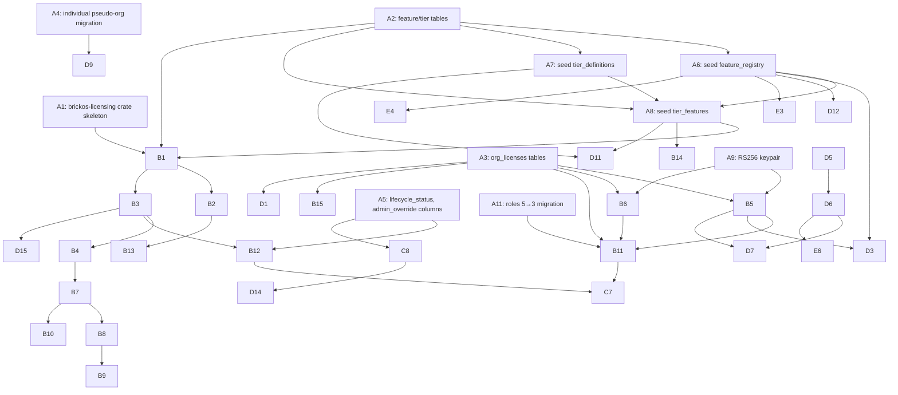

# 022 -- BrickOS Licensing Model

## 0. Purpose

Design 021 covers the **packaging** of white-label deals (Horizon as a sellable bundle). This document covers the **licensing model itself**: how features are gated, how tiers are enforced, what happens on payment failure, what happens on inactivity, how organizations vs individuals are represented, and how the **same model** serves all distribution paths the BrickOS suite ships through.

**Three distribution paths in scope:**

1. **Individual SaaS** -- single user pays Stripe / Strike, manages their own tier (Glimpse / Focus / Insight / Clarity).
2. **Organization SaaS / White-Label** -- a legal entity buys a custom package of seats (e.g. 10 staff + 50 patients at Insight) and Sovereign Brick invoices them, optionally via Stripe-synced manual invoices.
3. **Self-hosted** -- the binary runs on the customer's hardware. Three sub-flavors:
   - **Core OSS** -- AGPL-3.0 distribution for genuine open-source self-hosters. Today: shipped via Docker, planned via **Start9** marketplace and **Flatpak**. Today's enforcement: `SHI_MODE=oss` returns unlimited.
   - **Core Commercial** (planned) -- a paid on-prem license for individuals or small clinics who want a single-instance install with sovereignty guarantees. Same binary, different license certificate.
   - **Self-hosted Org / Clinic** (planned) -- multi-tenant on-prem deployment for clinics that want their own server with multiple staff and patients on it. Same packaging as the SaaS Horizon org tier, but the binary lives on the customer's hardware.

This document also reconciles the **three contradictory definitions of Glimpse** in production today, fills the **dead-code gap** in the JWT licensing path, **elevates licensing to a brickos-platform service** so every app reads from one source, and makes the model **offline-tolerant** for self-hosted distribution.

> **Reading order:** Section 1 audits today's state. Sections 2-3 specify the individual and organization models. Section 4 specifies the elevated brickos-licensing platform service that all apps consume. Section 5 specifies the self-hosted distribution paths. Section 6 specifies the JWT certificate format. Section 7 specifies the BrickOS admin GUI. Section 8 lists concerns, risks, improvements. Section 9 is the implementation plan as a single large sprint with a dependency graph. Section 10 covers AGPL alignment. Section 11 records the decisions made on the open questions from v1. Section 12 is the recommendation.

---

## 1. Audit -- What Exists Today

### 1.1 Two parallel licensing systems, only one wired up

| System | Storage | Enforced? | Used for |
|---|---|---|---|
| **A. user_licenses + Stripe** | `user_licenses(user_id, tier_id, status, grace_period_ends, ...)` | **YES** | All B2C customers today |
| **B. JWT license tokens** | None (token returned in API response, never persisted) | **NO** (zero callers) | Originally intended for on-prem; never wired up |

System A is the only enforcement path. `services/tier.rs::check_feature(pool, user_id, feature)` is called from 12 handlers and reads `user_licenses` joined with `license_tiers`. `services/licensing.rs::validate_license / check_seat_limit / has_feature` exist but are **only called by their own unit tests** -- no handler, middleware, or service consumes them.

The `POST /admin/organizations/{id}/license` endpoint generates a signed HS256 JWT, returns it in the JSON response, and that's it. Nothing reads it back. `organizations.tier_id` is also dead -- present in the schema, never read by any handler.

### 1.2 The Glimpse "8 markers" problem -- three contradictory definitions

| Source | Says | File |
|---|---|---|
| Public website | **"10 markers, Basic dashboard, 3 AI questions/month"** | `apps/health/sovereign-health/website/src/data/features-en.json:19` |
| Database seed | `max_markers = 20` (most recent), previously `max_markers = 8` | `apps/health/sovereign-health/api/migrations/...batch17_licensing.sql` |
| Hardcoded enforcement | **`GLIMPSE_MARKERS = [8 specific marker slugs]`** -- glucose, ketones, bp_systolic, bp_diastolic, heart_rate, weight, chol_total, hba1c | `apps/health/sovereign-health/api/src/services/tier.rs:12` |

And the enforcement code (`services/tier.rs:376-395`) is even stranger:

```rust
pub async fn check_marker_access(pool, user_id, marker_slug) {
    let tier = get_user_tier(pool, user_id).await?;
    if tier.max_markers.is_none() { return Ok(()); }   // unlimited
    if GLIMPSE_MARKERS.contains(&marker_slug) { return Ok(()); }
    Err(UpgradeRequired(...))
}
```

`max_markers` is read but **only as a boolean** ("limited or not"). The actual marker allow-list comes from a hardcoded const. The number `20` (or `8`, or `10`) in `license_tiers.max_markers` is **not used for anything**. Glimpse is not "8 markers of your choice" -- it is "exactly these 8 specific markers, no other markers will ever work, the database number is decorative."

Three separate places of truth, none of which agree, and the "limit" is actually a fixed allow-list. **Decision: zero hardcoding in v2 (Section 2.2).**

### 1.3 Downgrade flow -- partial

| Concern | Status |
|---|---|
| Stripe webhook -> grace period start | ✅ `handlers/billing.rs::handle_subscription_deleted` |
| Grace period read in `get_user_tier` | ✅ Returns previous tier limits until `grace_period_ends` |
| Cancellation email | ⚠️ Sent, but **branded as SHI / Stripe**, not BrickOS |
| Payment-failure reminder emails (3-7-14 days) | ❌ NOT IMPLEMENTED |
| **All transactional emails carry brickos.io branding** | ❌ Today they carry SHI branding; needs platform rebrand |
| Self-service downgrade endpoint | ❌ Stripe portal only |
| BTC prepaid expiry handling | ⚠️ Partial -- `payment_method` branch exists in `tier.rs:199-214` |
| Visible "your tier expires in X days" banner | ❌ NOT IMPLEMENTED |
| Read-only data preservation after downgrade | ⚠️ Data stays in DB but UI just errors with `UpgradeRequired` -- no "read-only history" mode |

> **Branding note:** every transactional email related to billing, license, payment failure, downgrade, and renewal must carry **brickos.io** branding (not Sovereign Health branding), because the customer's contract is with Sovereign Brick the platform, not with the SHI app. SHI continues to brand its own clinical emails (lab import results, AI insights, sharing notifications). The split is: **billing & license = brickos.io; clinical = app brand**. For first customers, manual templates are acceptable -- the brickos admin can copy a template, fill in variables, and send by hand. Automation comes after the templates exist.

### 1.4 Inactivity / account deletion -- nothing automated

`users.last_login_at` and `users.last_active_at` exist. Both are written. **Neither is read by a cleanup job.** No 30/90/365-day inactivity purge exists. The only deletion path is GDPR-on-request (manual). Email templates `account_deletion()` and `account_deletion_de()` exist for the manual case.

### 1.5 User-organization pollution -- 1:1 today

Every user gets a personal organization auto-created at signup (or backfilled by migration `20260316000076`):

```sql
INSERT INTO organizations (name, slug, org_type, billing_email, ...)
SELECT COALESCE(display_name, email_prefix), 'personal-' || id, 'personal', email, ...
FROM users
```

Then a row in `org_members` with `role='org_owner'`. Result: `COUNT(organizations) ≈ COUNT(users) + a few real orgs`. The orgs table is polluted with one row per user, and `org_type='personal'` is the only thing that distinguishes them.

### 1.6 Admin override -- exists but advisory

`PUT /admin/users/{id}/license` (in `handlers/admin.rs`) sets `user_licenses.admin_override = true` plus audit fields. **But `get_user_tier()` does not branch on `admin_override`** -- the field is logged, not enforced. The tier change works only because the same handler also writes `tier_id`. Renaming `admin_override` to `admin_override_audit` would clarify the intent.

### 1.7 Self-hosted / Core -- one env var

```rust
// services/tier.rs:129
if std::env::var("SHI_MODE").unwrap_or_default() == "oss" {
    return Ok(unlimited_tier("core"));
}
```

That's the entire self-hosted enforcement story. No JWT, no signature, no expiry. Set `SHI_MODE=oss` and you get unlimited everything. This is fine for genuinely open-source self-hosters; Section 5 covers what to add for the planned commercial and clinic on-prem flavors.

### 1.8 Summary of audit findings

| # | Finding | Severity |
|---|---|---|
| F1 | JWT licensing path is dead code (orphan generator, no consumer) | HIGH |
| F2 | Glimpse semantics inconsistent across 3 sources, "limit" is decorative, allow-list is hardcoded | HIGH |
| F3 | Inactivity tracking not surfaced (Glimpse users may be dormant for years; admin has no view) | MEDIUM |
| F4 | One personal org per user pollutes `organizations` table | MEDIUM |
| F5 | Admin override flag not enforced (audit-only) | MEDIUM |
| F6 | No payment-failure reminder emails | MEDIUM |
| F7 | No "read-only history" mode after downgrade -- everything 403s | MEDIUM |
| F8 | `organizations.tier_id` is dead code | LOW |
| F9 | Self-hosted has no anti-piracy whatsoever | LOW (intentional for OSS, problem for paid on-prem) |
| F10 | No self-service downgrade endpoint | LOW |
| F11 | Each app re-implements its own feature gating; no shared licensing service | HIGH (architectural) |
| F12 | Billing emails carry SHI branding instead of brickos.io | LOW |

---

## 2. Target Model -- Individual User SaaS

### 2.1 Lifecycle

```
   signup
     |
     v
  [Glimpse, free]  <----------+
     |                        |
     | upgrade (Stripe/Strike)|
     v                        |
  [paid tier: Focus/Insight/  |
   Clarity]                   |
     |                        |
     | payment fails or       |
     | user cancels           |
     v                        |
  [grace_period, 14 days,     |
   keeps previous tier]       |
     |                        |
     | grace expires          |
     v                        |
  [Glimpse, downgraded] ------+
     |
     | inactive 365 days  (Glimpse only -- paying users never get inactivity-flagged)
     v
  [dormant: visible to brickos admin, NOT auto-deleted]
     |
     | admin reviews + manual decision
     v
  [retained, contacted, or manually purged]
```

**Key decision: paying users are never inactivity-flagged.** Only Glimpse (free) users transition to `dormant` after 365 days of no activity. A user who pays for Focus and uses the app once a year is a paying customer, not a dormant account. The 365-day rule exists to keep the database from growing forever with abandoned free accounts, not to penalize paying users.

**Key decision: no auto-deletion.** When a user crosses the 365-day Glimpse threshold, they are flagged `dormant` and shown in a brickos admin "Dormant Accounts" view. The admin can review the cohort and decide. The Terms & Conditions reserve the legal right to delete dormant data, but execution is manual until deletion volume justifies automation.

### 2.2 Glimpse, redefined and fixed

**Decision (locked):** Glimpse is **"any 10 markers of the user's choice, plus 30 days of history."** Drop the hardcoded `GLIMPSE_MARKERS` allow-list. Make `max_markers` actually mean what it says.

**Decision (locked):** **Calculated markers are unlimited for all tiers.** A calculated marker (GKI, BMI, TG/HDL ratio, WHtR) is a derivation from biomarkers the user already tracks. Capping calculated markers makes no sense: the more biomarkers the user has, the more calculated markers they can fill in, and we want users to *see* derived insights for free. Calculated markers are a feature, not a unit of cost. Remove `max_calculated_markers` from `license_tiers`.

**Active vs. preserved markers (locked):**

- A user follows N markers (rows in `user_markers`).
- On Glimpse, only the first 10 are *active*. The other N-10 are *preserved*.
- **Active markers**: full read/write, dashboard, charts, alerts, new measurements.
- **Preserved markers**: **visible read-only**, dimmed in the UI, historical data fully readable, **cannot enter new measurements** until activated. Shown in a "Preserved (upgrade to activate)" section.
- The user can swap which 10 are active at any time (e.g. unfollow weight, follow ldl).

This solves the downgrade problem without data loss and without surprise lockouts. The user can always *see* their data ("you have 42 markers preserved, 10 active -- upgrade to Focus to activate all of them").

**Glimpse limits (single source of truth, in `license_tiers`):**

| Feature | Glimpse limit | Notes |
|---|---|---|
| Active markers | **10** | User picks any 10 |
| History days | 30 | Older measurements visible read-only on the active markers |
| AI chat (any agent) | 3/month | Pooled across all chat agents |
| **Calculated markers** | **unlimited** | Derived from active markers, no cap |
| Measurement templates | 1 | One saved routine |
| PDF reports | 0 | Upgrade required |
| CSV/JSON export | No | Upgrade required |
| Custom thresholds (Reference Ranges) | No | |
| Lifestyle presets | No | |
| Cohort comparison (Benchmark) | No | |
| MFA TOTP | **Yes** | Security feature, never gated |

The exact numbers live **only** in `license_tiers` (or, after Section 4, in `feature_registry` + `tier_features`). The website JSON, the in-app upgrade dialog, and the brickos admin GUI all read from the platform license API. No more triple-source-of-truth and no more hardcoded constants in Rust.

### 2.3 Other tiers -- semantic clarification

For Focus / Insight / Clarity, the same "active vs. preserved" model applies but with higher caps:

| Tier | Active markers | History | AI chat | Calc markers | Templates | Notable features |
|---|---|---|---|---|---|---|
| Glimpse | 10 | 30d | 3/mo | unlimited | 1 | -- |
| Focus | 75 | unlimited | 5/mo | unlimited | 3 | csv/json export, reference ranges |
| Insight | 200 | unlimited | 15/mo | unlimited | 5 | + lifestyle presets, body comp, supplement impact, AI insights |
| Clarity | unlimited | unlimited | unlimited | unlimited | unlimited | + cohort, api_access |
| Horizon | unlimited | unlimited | unlimited | unlimited | unlimited | + white-label, multi-user, dedicated support |

`team_sharing`, `max_team_members`, `api_access`, `self_hosted_hybrid` are **organization concepts**, not individual ones. Move them out of `license_tiers` into the `org_features` half of the feature registry (Section 4.7). A Clarity *individual* user does not get team sharing -- that's for the Horizon org bundle.

### 2.4 The "Individual User" pseudo-org

**Decision:** Stop creating one row per user in `organizations`. Create a single platform-wide "Individual User" pseudo-org once:

```sql
INSERT INTO organizations (id, name, slug, org_type, billing_email)
VALUES (
  '00000000-0000-0000-0000-000000000001',
  'Individual User',
  'individual',
  'system',
  NULL
);
```

Every user who is not a member of any real org is implicitly a member of `'individual'`. No `org_members` row is needed for individuals -- the absence of an org_members row *means* they are individual. When code needs an org context for an individual user, it uses the `'individual'` UUID.

This:

- Cleans up `organizations` from N+1 rows to ~10.
- Makes `org_type` meaningful (only `'business'`, `'clinic'`, `'enterprise'`, `'family'`, `'system'`).
- Removes the need to backfill personal orgs on every signup.
- Makes "is this user paying as an individual or via an org?" a real query.

**Migration path (no live users to break -- ship directly):**

1. Insert the `'individual'` system org.
2. For each `organizations` row with `org_type='personal'`, delete the row and the corresponding `org_members` row.
3. The user's `user_licenses` row is unchanged -- it was always user-keyed, not org-keyed.
4. Update the few handlers that join on `org_id` to fall back to the `'individual'` UUID when zero rows are returned.

### 2.5 Payment failure -> grace -> downgrade -> dormant

**Grace period (14 days, configurable per tier):**

1. Day 0: Stripe webhook reports `customer.subscription.deleted` or `payment_intent.payment_failed`.
2. `user_licenses.status = 'downgrade_grace'`, `previous_tier_slug = current`, `grace_period_ends = NOW() + 14d`. *(Already implemented.)*
3. **NEW:** Send brickos.io-branded emails on day 0, day 7, day 13. Templates ship as static files; first sends are manual; automation comes once templates are validated.
4. **NEW:** In-app banner: "Your subscription failed. You have N days until you are downgraded to Glimpse. Update payment method."
5. Day 14: scheduled job downgrades to Glimpse: `tier_id = (Glimpse), status = 'active', previous_tier_slug = (the old tier, kept for one-click re-upgrade)`.
6. Send brickos.io-branded "downgraded" email with one-click reactivate link.

**Inactivity tracking (Glimpse-only, no auto-delete):**

1. Day 0 of last activity: `users.last_active_at` updated by middleware.
2. Day 365: scheduled job sets `users.lifecycle_status = 'dormant'` **only if `tier == 'glimpse'`**.
3. Brickos admin sees the user in the "Dormant Accounts" view in the platform admin GUI.
4. Admin reviews the cohort periodically and decides on a case-by-case basis: contact, retain, or schedule manual deletion.
5. On any login or API call, `lifecycle_status` resets to `'active'` automatically.

**Why no auto-delete.** Auto-deleting accounts is a load-bearing decision that needs evidence of churn cost vs. retention value. We don't have that evidence yet. Reserving the right in T&C and surfacing the cohort to admins is enough governance to start; automation can follow once the dormant volume justifies it.

**T&C clause to add to https://sovereignhealth.io/terms/:**

> **Account Inactivity.** Free-tier (Glimpse) accounts that show no activity for 365 consecutive days may be flagged as dormant. Sovereign Brick reserves the right to delete dormant free-tier accounts and their associated data after written notice to the email on file. Paid-tier accounts are not subject to inactivity-based deletion as long as the subscription is active. Users may export their data at any time via the in-app export feature.

### 2.6 Admin override -- enforced, not just audited

**Decision:** Make `admin_override` actually short-circuit. New logic in `get_user_tier`:

```rust
let row = sqlx::query("...SELECT ... admin_override, admin_override_tier_slug, admin_override_expires_at ...").await?;
if row.admin_override
   && row.admin_override_tier_slug.is_some()
   && row.admin_override_expires_at.map_or(true, |exp| exp > Utc::now())
{
    return Ok(load_tier(row.admin_override_tier_slug.unwrap()));
}
// ... existing Stripe/BTC enforcement
```

Add `admin_override_tier_slug` and `admin_override_expires_at` columns. Override can be permanent (`expires_at = NULL`) or time-bounded.

Use cases:
- Family members of the founder: `admin_override='clarity'`, `expires=NULL`.
- Press / influencer reviews: `admin_override='insight'`, `expires=NOW()+90d`.
- Customer support compensating an outage: `admin_override='current'`, `expires=NOW()+30d`.
- Beta testers of a new tier: `admin_override='horizon'`, `expires=NOW()+180d`.

All changes log to `admin_audit_log`.

---

## 3. Target Model -- Organization SaaS / White-Label

### 3.1 Anchor concepts

- An **organization** has zero or more members in `org_members` with one of three roles: **`org_owner`**, **`practitioner`**, **`member`**. (Down from five -- see 3.2 for the analysis.)
- An organization has **one active org license** (`org_licenses` table, see 3.3). The license carries the tier, seat caps, features, and expiry.
- A user can be a member of **multiple organizations** at once (each with its own role) and can also have an individual `user_licenses` row.
- The user's **effective tier** in a given session is determined by the active org context -- see 3.5.

### 3.2 Roles -- deep dive and reduction

**Today's roles (5):** `org_owner`, `tech_admin`, `commercial_admin`, `editor`, `consumer`

**Problems with the current model:**

1. **Tech admin vs commercial admin** is enterprise-grade separation of duties. SHI sells to clinics and small practices where the same person is the doctor, the IT contact, and the billing contact. Splitting `tech_admin` from `commercial_admin` means every customer onboarding requires explaining a distinction that doesn't matter to them.
2. **Editor** is a generic name that doesn't match any clinical persona. The actual user is a *practitioner* (doctor, coach, nurse, dietician).
3. **Consumer** is a problematic name in white-label health. To a clinic admin it sounds like "customer," not "patient." White-label customers in non-medical apps (CRM, Signal) will want to call them "client" or "member." The role slug should be brand-neutral; the *display label* should be customizable per org branding.

**Best practice in B2B SaaS:**

| Vendor | Role count | Roles |
|---|---|---|
| Slack | 4 | Workspace Owner, Admin, Member, Guest |
| Notion | 3 | Workspace Owner, Member, Guest |
| Linear | 3 | Admin, Member, Guest |
| GitHub (org) | 4 | Owner, Admin, Member, Outside collaborator |
| Discord | 4 | Owner, Admin, Member, Guest |
| Stripe | 5 | Owner, Admin, Developer, Analyst, Read-only -- splits *for accounting workflows*, which is unusual |
| Atlassian | 4-5 | Site Admin, Org Admin, User, App access -- enterprise-only complexity |

**Convergence:** modern B2B SaaS uses **3-4 roles**. The split between billing-admin and tech-admin only appears in enterprise vendors selling to organizations with separate IT and finance departments. SHI's customer is a clinic with 3-15 people; that separation does not exist in their org chart.

**Decision: 3 roles for SHI (and all BrickOS apps).**

| Role slug | Display label (default) | Display label (clinical brand) | Purpose | Typical count |
|---|---|---|---|---|
| `org_owner` | Owner | Clinic Owner | Billing, license, full app access. Receives invoices and renewal notices. Can transfer ownership. | 1-3 |
| `practitioner` | Member | Practitioner | Clinical access. Can manage patients, view all patient data within the org, create plans, run reports. Cannot change billing or license. | 1-50 |
| `member` | Member | Patient | Sees only their own data. Can be invited by a practitioner. Has all consumer features available in the tier. | 1-unlimited per org |

**Display label override:** the `organizations.branding` JSONB column gets a `role_labels` key:

```json
{
  "branding": {
    "logo_url": "...",
    "primary_color": "...",
    "role_labels": {
      "org_owner": "Clinic Owner",
      "practitioner": "Doctor",
      "member": "Patient"
    }
  }
}
```

The slug is what code checks. The label is what the UI shows. Different orgs with different brands can present the same role with different terminology without forking the schema.

**Use cases per role:**

- **Owner** -- the clinic owner signs the contract, gets the brickos.io invoice each month, has the only seat that can change the org's license tier, can invite/remove other members, can rename the org and edit branding. Often also a practitioner; in that case the same user holds both roles via two `org_members` rows.
- **Practitioner** -- the doctor/coach/nurse who actually uses SHI to help patients. Can invite patients (within seat cap), see patient data, run AI analyses, generate PDFs. Cannot see billing.
- **Member (Patient)** -- the end user. Logs in to enter measurements, see their dashboard, chat with AI agents, see notes from their practitioner. Cannot see other patients. Cannot see clinic billing.

**Migration from 5 → 3:**

| Old role | New role |
|---|---|
| `owner` | `org_owner` |
| `tech_admin` | `org_owner` (combined; office manager who is not the owner is an unusual case for our market) |
| `commercial_admin` | `org_owner` (combined) |
| `editor` | `practitioner` |
| `consumer` | `member` |

This is a one-time migration. No live customers to break. If a future enterprise customer needs the office-manager-without-clinical-access role, we add `org_admin` as a 4th role then -- not before.

**Seat enforcement after consolidation:** the JWT carries `max_owners`, `max_practitioners`, `max_members`. Section 6.1 has the updated claim shape.

### 3.3 New table: `org_licenses`

```sql
CREATE TABLE brickos.org_licenses (
    id              UUID PRIMARY KEY DEFAULT gen_random_uuid(),
    org_id          UUID NOT NULL REFERENCES organizations(id),
    tier_slug       VARCHAR(50) NOT NULL,        -- 'insight', 'clarity', 'horizon', or custom
    features        JSONB NOT NULL DEFAULT '[]', -- ["shi.csv_export", "branding.custom_domain", ...]
    max_owners      INT NOT NULL DEFAULT 1,
    max_practitioners INT NOT NULL DEFAULT 0,
    max_members     INT NOT NULL DEFAULT 0,      -- 0 = no patients; -1 = unlimited
    issued_at       TIMESTAMPTZ NOT NULL DEFAULT NOW(),
    expires_at      TIMESTAMPTZ NOT NULL,
    revoked_at      TIMESTAMPTZ,
    jwt_token       TEXT NOT NULL,               -- the signed certificate (Section 6)
    issued_by       UUID REFERENCES users(id),   -- brickos admin who issued it
    notes           TEXT,
    stripe_invoice_id TEXT,                      -- nullable; populated when billed via Stripe sync
    created_at      TIMESTAMPTZ NOT NULL DEFAULT NOW(),
    updated_at      TIMESTAMPTZ NOT NULL DEFAULT NOW()
);

CREATE INDEX idx_org_licenses_org_active
    ON org_licenses (org_id)
    WHERE revoked_at IS NULL;
```

The JWT is **the certificate of license**. The DB row is **the cache, the audit trail, and the link to the Stripe invoice**. Both must agree -- the JWT is re-validated server-side every 5 minutes (cached parse), and the row is queried only for revocation check, audit, and Stripe link.

### 3.4 Custom org packages

A brickos admin builds a custom package via the GUI (Section 7) by setting:

- **Tier slug** (any of the public tiers, or `'custom'`).
- **Features list** (multi-select from the feature registry, namespaced per app -- e.g. `shi.csv_export`, `crm.lead_capture`, `link.api_access`).
- **Seat caps** (max_owners, max_practitioners, max_members as separate counters).
- **Expiry** (1 / 6 / 12 months, or arbitrary).
- **Notes** (free text -- "10 staff + 50 patients, monthly invoice 623 EUR, contact: jane@clinic.de").

Example custom package: "Insight for Acme Clinic, 10 staff + 50 patients, 1 year":

```json
{
  "tier_slug": "insight",
  "features": [
    "shi.csv_export", "shi.json_export", "shi.pdf_reports",
    "shi.custom_thresholds", "shi.lifestyle_presets",
    "shi.protocol_comparison", "shi.body_composition",
    "shi.supplement_marker_impact", "shi.ai_dashboard_insights",
    "branding.custom_logo", "branding.custom_colors",
    "support.email"
  ],
  "max_owners": 1,
  "max_practitioners": 9,
  "max_members": 50,
  "expires_at": "2027-04-10T00:00:00Z"
}
```

Adding 50 more patients later = generate a new license, increment `max_members` to 100, set `revoked_at` on the old license, save the new JWT, optionally trigger a new Stripe invoice line.

### 3.5 Effective tier resolution

When a user makes an authenticated request, the API computes their **effective tier** for that request via the brickos-licensing platform service (Section 4):

```
1. Determine org context for this request
   - If user has 0 active org memberships: org_context = 'individual'
   - If user has 1 active org membership: org_context = that org_id
   - If user has >1: client must specify ?org=<org_id> or pick one in UI; default = most-recently-active

2. Look up effective tier (via brickos-licensing client)
   - If org_context == 'individual':
       use user_licenses (Stripe-driven, with admin_override fallback)
   - Else:
       fetch active org_licenses row for org_context (from local cache or platform)
       validate JWT (signature + exp)
       return tier slug + feature list + seat caps from JWT claims

3. Cache the effective tier in the request extensions for the duration of the request.
```

### 3.6 Seat enforcement

`add_org_member` (currently 38 lines, no enforcement) gains a check:

```rust
let license = brickos_licensing::load_active(org_id).await?;
let claims = brickos_licensing::validate(&license.jwt_token).await?;
let current = count_members(org_id, &body.role).await?;
if !claims.allows_seat(&body.role, current) {
    return Err(SeatLimitExceeded {
        role: body.role.clone(),
        current,
        max: claims.max_for_role(&body.role),
    });
}
// proceed with INSERT
```

Same check on `update_member_role` (changing a `member` to a `practitioner` needs to check the practitioner cap).

### 3.7 Org termination -- consumers default to "invite to individual plan"

**Decision (locked):** when an org's license expires or is cancelled, its members (the patients/clients) are **invited to switch to an individual plan** by default. They can opt out and self-delete if they prefer.

The flow:

1. License `expires_at` arrives (or admin manually terminates).
2. The org goes into `org_status = 'terminated_grace'` for 30 days.
3. Each `member` (former patient) receives a brickos.io-branded email: *"Acme Clinic's subscription has ended. Your data is yours. Continue with a free Glimpse account, upgrade to Focus, or download your data and close your account. You have 30 days to choose."*
4. Default action if user does nothing: a Glimpse `user_licenses` row is created on day 30 and the user's `org_members` row is removed. They keep their data; the data follows the same Glimpse rules (10 active markers, others preserved read-only).
5. If the user clicks "Delete my data": account is scheduled for soft-delete in 30 more days, with the same restore window.
6. If the user clicks "Upgrade to Focus": Stripe checkout flow.

The org's `org_owner` and `practitioner` users follow Section 3.8.

### 3.8 Org termination -- staff (org_owner / practitioner)

Org staff are different from members -- they typically don't have personal health data in the system, only their access to the clinic's patients. On org termination:

- Their `org_members` row in the terminated org is removed after the 30-day grace.
- If they have other active org memberships, they continue with those.
- If they have no other org memberships and no individual `user_licenses` row, they fall back to `'individual'` context with a Glimpse default.
- If they had a personal Stripe sub running in parallel, it continues unaffected.
- They get a brickos.io-branded email on org termination explaining what changes for them.

### 3.9 Org billing model -- Stripe sync for manual invoices

**Decision:** rather than rebuilding the billing system for org-level metered subscriptions, **build a Stripe sync layer** that the brickos admin uses to create and send manual invoices via Stripe's invoicing product (not the subscription product).

**Why:** Stripe's invoicing API supports one-off invoices with line items, sent by email, paid by credit card or SEPA, with full PDF and dunning. It is purpose-built for the "monthly bill to a B2B customer" use case. We do not need subscription metering, prorations, or webhooks for the first 1-10 customers. We just need an admin GUI that lets us configure invoice line items and trigger Stripe to send the invoice.

**Architecture:**

```
   brickos admin GUI (platform.brickos.io)
            │
            │  1. Configure invoice
            │     (line items, amounts, due date)
            │
            ▼
   brickos-billing service
            │
            │  2. Sync to Stripe
            │     (POST /v1/invoices,
            │      POST /v1/invoiceitems,
            │      POST /v1/invoices/{id}/finalize)
            │
            ▼
        Stripe API
            │
            │  3. Stripe sends invoice email,
            │     handles payment, sends receipt
            │
            ▼
       Customer pays
            │
            │  4. Stripe webhook -> brickos-billing
            │     -> mark invoice paid in DB
            │     -> regenerate or extend org_licenses JWT
            │
            ▼
   org_licenses row updated, customer notified
```

**Brickos billing GUI fields (per invoice):**

- Customer (org dropdown)
- Currency (EUR / USD / CHF)
- Line items (repeatable rows):
  - Product (dropdown of pre-configured Stripe products: "SHI Horizon Practice Base", "Additional Practitioner Seat", "Custom Domain", "M&E Fee", "Onboarding")
  - Quantity
  - Unit price
  - Tax rate (auto-set per Stripe tax settings, EU reverse-charge supported)
- Due in (7 / 14 / 30 days)
- Description / memo
- "Sync to Stripe and send" button (triggers steps 2-3)
- "Save as draft" button (creates the Stripe invoice in draft state, doesn't send)

**Stripe products to pre-configure (one-time setup, manual via Stripe dashboard):**

| Stripe product | SKU | Default price (EUR) | Recurring? |
|---|---|---|---|
| SHI Horizon Practice Base (10 patients, 1 owner, 5 practitioners) | shi-horizon-base | 499 | One-off invoice |
| Additional patient seats (block of 10) | shi-horizon-patients-10 | 89 | One-off |
| Additional practitioner seat | shi-horizon-practitioner-1 | 39 | One-off |
| Custom domain (per month) | shi-horizon-domain | 49 | One-off |
| Maintenance & Evolution (15% of base) | shi-horizon-me | calculated | One-off |
| Onboarding (one-time) | shi-horizon-onboarding | 1500 | One-off |
| Priority support SLA | shi-horizon-priority | 199 | One-off |

The admin clicks "New invoice for Acme Clinic", picks the line items, sets quantities, hits sync. Stripe invoice gets created in draft, finalized, and emailed. When the customer pays, the Stripe webhook fires `invoice.paid`, which triggers `brickos-billing` to extend or regenerate the org's license JWT.

**Why this is the right shape now:**

- Zero subscription complexity (no metering, no prorations, no mid-cycle changes).
- Customer gets a real Stripe-hosted invoice with PDF, branded as brickos.io (Stripe branding configured in Stripe dashboard).
- All payment methods Stripe supports work (cards, SEPA, ACH, BACS, etc.).
- Tax handling is Stripe's responsibility (we configure once, Stripe applies).
- Audit trail lives in Stripe and in `org_licenses.stripe_invoice_id`.
- We can graduate to true subscriptions (Phase 2 of design 021) later when we have 10+ customers and the manual flow becomes painful.

**For BTC payments:** Stripe doesn't accept Bitcoin. For BTC org customers, the same admin GUI generates a Strike Lightning invoice via the existing `brickos-billing::strike` path. The form selects payment rail (Stripe or Strike) before sending. Strike webhooks handle the payment confirmation the same way.

---

## 4. Elevated brickos-licensing Platform Service

### 4.1 Vision

**Today:** SHI has its own `services/tier.rs` with hardcoded constants and direct SQL against `user_licenses` and `license_tiers` in the SHI database. Sovereign CRM, Sovereign Link, Sovereign Voice, and any future BrickOS app would each re-implement the same logic against their own database. **This does not scale.**

**Target:** licensing is a **platform-level service**, exactly like auth, email, and notifications. Every BrickOS app calls into the same `brickos-licensing` service to:

- Look up tier definitions (single source of truth across all apps)
- Look up feature definitions (master registry)
- Resolve a user's effective tier in a given org context
- Check whether a feature is enabled
- Generate / validate / revoke org license JWTs

The service runs on `platform.brickos.io` as part of the brickos-platform-api binary, with its own database tables in the `brickos` schema. Each app links the `brickos-licensing` Rust crate as a dependency and uses it as a client (Rust function calls if same binary; HTTP REST calls if separate binaries).

### 4.2 Architecture

```
                        ┌────────────────────────────────────────────┐
                        │  brickos-platform-api (platform.brickos.io)│
                        │                                            │
                        │  ┌──────────────────────────────────────┐  │
                        │  │  brickos-licensing service           │  │
                        │  │                                      │  │
                        │  │  Tables (brickos schema):            │  │
                        │  │  - feature_registry                  │  │
                        │  │  - tier_definitions                  │  │
                        │  │  - tier_features (join)              │  │
                        │  │  - user_licenses                     │  │
                        │  │  - org_licenses                      │  │
                        │  │  - org_licenses_revoked              │  │
                        │  │  - admin_audit_log                   │  │
                        │  │                                      │  │
                        │  │  Endpoints:                          │  │
                        │  │  GET  /licensing/tiers               │  │
                        │  │  GET  /licensing/features            │  │
                        │  │  GET  /licensing/effective?user=&org=│  │
                        │  │  POST /licensing/orgs/{id}/license   │  │
                        │  │  POST /licensing/orgs/{id}/revoke    │  │
                        │  │  PUT  /licensing/users/{id}/override │  │
                        │  └──────────────────────────────────────┘  │
                        └────────────────┬───────────────────────────┘
                                         │
                                         │ HTTP + signed bearer token
                                         │ (apps authenticate to platform)
                                         │
              ┌──────────────────────────┼──────────────────────────┐
              │                          │                          │
              ▼                          ▼                          ▼
      ┌───────────────┐         ┌───────────────┐         ┌────────────────┐
      │ SHI api       │         │ Sovereign CRM │         │ Sovereign Link │
      │               │         │               │         │                │
      │ uses          │         │ uses          │         │ uses           │
      │ brickos-      │         │ brickos-      │         │ brickos-       │
      │ licensing     │         │ licensing     │         │ licensing      │
      │ client        │         │ client        │         │ client         │
      │               │         │               │         │                │
      │ Local cache:  │         │ Local cache:  │         │ Local cache:   │
      │ tier_cache    │         │ tier_cache    │         │ tier_cache     │
      │ (offline 370d)│         │ (offline 370d)│         │ (offline 370d) │
      └───────────────┘         └───────────────┘         └────────────────┘
              │                          │                          │
              └──────── shi.* ───────────┼──────── crm.* ───────────┘
                                         │
                                       link.*
```

### 4.3 The `brickos-licensing` crate (shared library)

Lives at `crates/brickos-licensing/`. Two modes:

- **Embedded mode** -- when the caller is the brickos-platform-api itself. Reads directly from the `brickos` schema. No HTTP overhead.
- **Client mode** -- when the caller is a separate app (SHI, CRM, Link). Makes HTTP calls to `https://platform.brickos.io/licensing/...` with a service account bearer token, caches results locally.

Each app picks the mode at startup via config:

```rust
// SHI main.rs
let licensing = if config.embedded_licensing {
    BrickosLicensing::embedded(brickos_pool.clone())
} else {
    BrickosLicensing::client(
        config.platform_api_url.clone(),
        config.service_account_token.clone(),
        config.cache_dir.clone(),
    )
};
```

Same trait, two implementations. Tests use the embedded mode against an in-memory test DB.

### 4.4 Per-app cache + offline mode (370-day grace)

**Requirement:** apps must keep working when the platform API is unreachable. For SaaS apps in the same datacenter, this is rare but possible (deploy windows, network blips). For on-prem self-hosted instances, this is the **default mode** -- the platform API may be unreachable for weeks.

**Design:**

Every app maintains a local cache of:
- The full feature registry
- The full tier definitions
- The active org_licenses for orgs that have used this app
- The active user_licenses for users who have used this app

The cache lives in:
- A SQLite file (`/var/lib/<app>/licensing-cache.db`) for self-hosted
- An in-memory + DB-backed cache for SaaS apps

**Cache freshness rules:**

| Item | Refresh interval | Stale tolerance |
|---|---|---|
| Feature registry | Every 1h, on startup | Use stale forever (registry rarely changes; new features just don't appear until refreshed) |
| Tier definitions | Every 1h, on startup | Same |
| User license (individual) | On every request, 5-min cache | 1h stale = warn, 24h stale = enforce cached, **370d stale = lockdown to Glimpse** |
| Org license (JWT) | On JWT load, then JWT validity rules apply | JWT `exp` is the source of truth; cache only stores it until `exp` |
| Revocation list | Every 60s | 1h stale = warn, 24h stale = continue but log, **never reach 370d for SaaS** |

**The 370-day grace rule:** if an app cannot reach the platform API for **370 consecutive days**, it locks the affected user/org to the lowest tier (Glimpse for individuals, "expired" for orgs) and shows a banner: "Cannot reach license server -- contact support." 370 days is intentionally one year + 5 days, so any annual maintenance contact resets it. For self-hosted instances this is plenty of time to renew; for SaaS instances it never trips because connectivity is constant.

**Offline write tolerance:** apps never *write* to the licensing service. They only read. All license mutations (issue, revoke, override) happen on the platform admin GUI and propagate to apps via the cache refresh.

### 4.5 Namespace management

Each BrickOS app gets a **namespace prefix** for its features:

| App | Slug | Namespace prefix | Example features |
|---|---|---|---|
| Sovereign Health Intelligence | sovereign-health | `shi.` | `shi.csv_export`, `shi.pdf_reports`, `shi.body_composition` |
| Sovereign CRM | sovereign-crm | `crm.` | `crm.lead_capture`, `crm.email_sequences` |
| Sovereign Link | sovereign-link | `link.` | `link.api_access`, `link.custom_domains` |
| Sovereign Signal | sovereign-signal | `signal.` | `signal.full_text_search` |
| Sovereign Voice | sovereign-voice | `voice.` | `voice.voice_clone` |
| Cross-app branding | -- | `branding.` | `branding.custom_logo`, `branding.custom_domain`, `branding.role_labels` |
| Cross-app support | -- | `support.` | `support.email`, `support.priority`, `support.sla_24x7` |

A feature is registered once in `feature_registry` with its full prefixed slug, the app it belongs to, a description, and a category. The feature appears in the brickos admin GUI under its app's group when an admin builds an org license.

A feature check in app code uses the prefixed slug:

```rust
// Inside SHI:
licensing.has_feature(user_ctx, "shi.csv_export").await?;

// Inside CRM:
licensing.has_feature(user_ctx, "crm.lead_capture").await?;
```

Cross-app features (`branding.*`, `support.*`) are checkable from any app:

```rust
licensing.has_feature(user_ctx, "branding.custom_logo").await?;
```

### 4.6 Migration: SHI tier.rs → brickos-licensing client

The current `apps/health/sovereign-health/api/src/services/tier.rs` is ~1000 lines of inlined feature gating. The migration:

1. Add `brickos-licensing` crate as a dependency in SHI's `Cargo.toml`.
2. Create a thin `services/licensing_facade.rs` in SHI that maps SHI's old API (`check_feature(pool, user_id, "csv_export")`) to the new prefixed API (`brickos_licensing.has_feature(ctx, "shi.csv_export")`).
3. Keep the old `services/tier.rs` calls in handlers temporarily; they delegate to the facade.
4. Once all 12 caller files are migrated, delete `tier.rs` and `licensing.rs` (the dead JWT generator).
5. Same migration applies to Sovereign CRM, Link, etc. -- but those don't have legacy code yet, so they start clean.

**Result:** every BrickOS app has the same licensing implementation (the `brickos-licensing` crate). Bugs are fixed in one place. New features are registered in one place. Tier definitions live in one place.

### 4.7 Feature registry -- adopted from day 1

Per design 029 + your decision to do this properly: **today's `license_tiers` boolean columns are deprecated**. The new model:

```sql
-- The master list of all features across all apps.
CREATE TABLE brickos.feature_registry (
    id          UUID PRIMARY KEY DEFAULT gen_random_uuid(),
    slug        VARCHAR(100) UNIQUE NOT NULL,  -- 'shi.csv_export', 'crm.lead_capture'
    app_slug    VARCHAR(50) NOT NULL,          -- 'sovereign-health', 'sovereign-crm', or '_platform' for cross-app
    category    VARCHAR(50) NOT NULL,          -- 'data_export', 'ai_chat', 'branding', 'support'
    name_en     VARCHAR(200) NOT NULL,
    name_de     VARCHAR(200) NOT NULL,
    description_en TEXT,
    description_de TEXT,
    is_active   BOOLEAN NOT NULL DEFAULT true,
    created_at  TIMESTAMPTZ NOT NULL DEFAULT NOW()
);

-- Tier definitions (replaces today's license_tiers boolean columns).
CREATE TABLE brickos.tier_definitions (
    id          UUID PRIMARY KEY DEFAULT gen_random_uuid(),
    slug        VARCHAR(50) UNIQUE NOT NULL,   -- 'glimpse', 'focus', 'insight', 'clarity', 'horizon', 'core'
    name        VARCHAR(100) NOT NULL,
    tagline     VARCHAR(200),
    description TEXT,
    price_monthly_eur DECIMAL(10,2),
    price_annual_eur  DECIMAL(10,2),
    display_order INT NOT NULL DEFAULT 0,
    is_active   BOOLEAN NOT NULL DEFAULT true,
    created_at  TIMESTAMPTZ NOT NULL DEFAULT NOW()
);

-- The join: which tier includes which feature, with optional limit.
CREATE TABLE brickos.tier_features (
    tier_slug    VARCHAR(50) NOT NULL REFERENCES tier_definitions(slug),
    feature_slug VARCHAR(100) NOT NULL REFERENCES feature_registry(slug),
    included     BOOLEAN NOT NULL DEFAULT true,
    limit_value  BIGINT,                       -- e.g. 10 for max active markers, NULL for unlimited
    limit_label_en VARCHAR(100),               -- '10 markers', 'unlimited'
    limit_label_de VARCHAR(100),
    PRIMARY KEY (tier_slug, feature_slug)
);
```

**Adding a new feature** is now: insert a row in `feature_registry`, then insert rows in `tier_features` for each tier that includes it. No migration. No new columns. No code change in any app's enforcement layer (apps just call `has_feature("app.new_feature")`).

**Adding a new tier** is: insert a row in `tier_definitions`, then bulk-insert `tier_features` rows for the features it includes.

**The website's `/api/v1/license/tiers` endpoint** returns the joined view, locale-aware, in the shape the public pricing page expects. Same endpoint serves the in-app upgrade dialog and the brickos admin GUI tier picker.

---

## 5. Self-hosted Distribution

### 5.1 Three flavors

| Flavor | Status | Audience | Distribution | Enforcement |
|---|---|---|---|---|
| **Core OSS** | Today | Genuine open-source self-hosters | Docker, planned: Start9 marketplace, Flatpak | None. `SHI_MODE=oss` returns unlimited. AGPL-3.0 is the legal protection. |
| **Core Commercial** | Planned | Paying single-instance individuals (privacy-first power users, regulated professionals) | Same Docker/Start9 binary + signed JWT license file | Signed RS256 JWT loaded from disk, validated locally, 370-day cache grace |
| **Self-hosted Org / Clinic** | Planned | Clinics that want their own server with multiple staff and patients on it | Same multi-tenant Docker stack + signed JWT for the org | Same as Core Commercial but with seat caps for `org_owner` / `practitioner` / `member` |

The **same binary** ships across all three flavors. The license certificate (or its absence) determines behavior:

- No license file present, `SHI_MODE=oss` set → Core OSS, unlimited.
- License file present → validate, apply tier and seat caps from JWT.
- License file present but expired beyond grace → fall back to read-only mode with banner.

### 5.2 Core OSS (today, unchanged)

`SHI_MODE=oss` continues to grant unlimited everything. AGPL-3.0 is the legal protection: any commercial deployment must publish source. If a customer is willing to ignore the AGPL, they will also ignore any technical license check. We don't pretend otherwise.

This serves the BrickOS values directly: anyone who wants to run their own instance for personal use can do so, freely, forever, with full features.

### 5.3 Core Commercial (planned)

Targeted at paying on-prem users who want a single-instance install with sovereignty guarantees but also want to support development financially and get email support.

- Same binary as Core OSS.
- Sovereign Brick generates a signed JWT with `tier='core_commercial'`, `max_owners=1, max_practitioners=0, max_members=0` (single user).
- Customer puts the JWT in `LICENSE_FILE=/etc/brickos/license.jwt` or env var `BRICKOS_LICENSE`.
- Binary on startup reads the file, calls `brickos_licensing::validate_local()`, caches the claims.
- **RS256 validation with embedded public key** (Sovereign Brick holds the private key).
- Every 24h, the binary re-validates the cached JWT.
- Optional `LICENSE_REFRESH_URL` env var: if set, binary polls daily for revocation list. If unset, no phone-home.
- **370-day offline grace**: once validated, the cached JWT is honored for up to 370 days even if the platform is unreachable. After that, falls back to read-only.
- If JWT is missing, expired beyond grace, or invalid: binary starts in **read-only / Glimpse mode** with a banner. It does **not** crash or refuse to start.

**Pricing decision (locked):** Core Commercial matches Horizon SaaS pricing (€99.99/month or €999.90/year, with annual prepay). Same value, different deployment model. The customer pays for the certainty that their data never leaves their hardware.

### 5.4 Self-hosted Org / Clinic (planned)

Targeted at clinics that want to run a private server with multiple practitioners and patients on it -- the on-prem equivalent of the SaaS Horizon org bundle.

- Same multi-tenant binary as the SaaS version.
- License JWT carries the same `org_owner` / `practitioner` / `member` seat caps as the SaaS Horizon package.
- Clinic admin manages members locally via the same admin UI screens.
- Same 370-day offline grace.
- Pricing: matches Horizon SaaS bundle prices (Section 3 of design 021).
- The brickos admin GUI on platform.brickos.io can issue licenses for self-hosted clinics; they download the JWT and drop it into their installation.

This is the equivalent of "GitLab Self-Managed Premium" -- same product as the cloud version, runs on your own hardware, sold as an annual contract.

### 5.5 Distribution channels

| Channel | Status | Notes |
|---|---|---|
| Docker (`docker compose up`) | Today | Reference distribution; works for all three flavors |
| Start9 marketplace | Planned | Curated app store for self-sovereign Linux servers; Core OSS first, Commercial later |
| Flatpak (Linux desktop) | Planned | Single-user desktop install; Core OSS / Core Commercial only |
| Bare-metal installer scripts | Planned | For clinics with their own Linux box and no Docker familiarity |
| Hosted "managed self-hosted" | Future | Sovereign Brick runs the box for the clinic (a hybrid offering) |

The same binary works across all channels. Distribution is just packaging.

### 5.6 RS256 migration

Today's `services/licensing.rs` uses HS256 with `config.jwt_secret`. Two problems:

1. The same secret signs the user auth JWTs and the license JWTs. If a customer's binary needs the secret to validate, they can also forge user auth tokens.
2. With HS256, signing and verifying use the same key. A customer with the secret can mint their own licenses.

**Decision:** License JWTs use **RS256** (asymmetric). Sovereign Brick holds the private key (`license_signing_key.pem`, never deployed, never in git, stored in 1Password Business). Every binary embeds the public key (`license_public_key.pem`, baked into the release artifact). User auth JWTs continue to use HS256 with `jwt_secret` -- they are short-lived and per-deployment, so symmetric is fine.

Key rotation procedure (documented separately): generate new keypair, ship new public key in next release, sign new licenses with new private key, accept both old and new public keys for a transition period of 6 months, then remove the old public key.

---

## 6. JWT License Certificate Spec

### 6.1 Format

```json
{
  "header": { "alg": "RS256", "typ": "JWT", "kid": "license-2026-04-01" },
  "claims": {
    "iss": "brickos-platform",
    "sub": "<org_id>",                          // org UUID, or 'individual:<user_id>'
    "aud": ["sovereign-health", "sovereign-crm"], // apps the license grants access to
    "iat": 1781830000,
    "exp": 1813366000,
    "nbf": 1781830000,
    "jti": "<license_id_uuid>",                 // for revocation list
    "org_name": "Acme Clinic",
    "tier": "horizon",
    "features": [
      "shi.csv_export",
      "shi.pdf_reports",
      "shi.body_composition",
      "branding.custom_logo",
      "branding.custom_domain",
      "support.email"
    ],
    "max_owners": 1,
    "max_practitioners": 9,
    "max_members": 50,
    "billing_model": "manual_invoice"           // or 'stripe_invoice' or 'self_hosted'
  }
}
```

### 6.2 Validation rules (server-side, every request after a 5-min cache)

1. Verify signature with current platform public key (`license_public_key.pem`).
2. Reject if `exp < now` or `nbf > now` (with 60s clock skew tolerance).
3. Check `aud` contains the app receiving the request (`sovereign-health`).
4. Check `jti` is not in `org_licenses_revoked` (cached in memory, refreshed every 60s).
5. Check `sub` matches the request's org context.
6. Cache the parsed claims for 5 minutes per `jti`. After 5 minutes, re-validate.

### 6.3 Revocation

A license can be revoked before its `exp` by:

```sql
UPDATE org_licenses SET revoked_at = NOW() WHERE id = $1;
INSERT INTO org_licenses_revoked (jti, revoked_at, reason) VALUES ($jti, NOW(), $reason);
```

The in-memory revocation list is reloaded every 60 seconds. Periodic cleanup removes revocation entries whose original `exp` has already passed.

### 6.4 Self-hosted offline validation

Self-hosted binaries cannot reach the revocation list reliably. For self-hosted:

- No revocation possible mid-period unless `LICENSE_REFRESH_URL` is configured.
- `exp` is set to the contract end + 30 days grace.
- If a customer breaches contract and refresh URL is configured, Sovereign Brick can issue a kill switch via the revocation list. Customers who disable network access accept that revocation only takes effect at contract renewal.
- 370-day cached license validity (Section 4.4) lets the binary keep working through extended outages.

### 6.5 Renewal

30 days before `exp`, the brickos admin GUI shows a "renewal due" alert. Admin clicks "Renew", picks new expiry, generates a new JWT, marks the old one as `revoked_at = NOW()`, and emails the new JWT to the customer along with the next Stripe invoice. For self-hosted customers, the customer drops the new JWT file in place; the binary picks it up on its next 24h check (or restart).

---

## 7. BrickOS Admin GUI

### 7.1 Where it lives

**Platform-level**, not in the SHI app. Per design 021 Section 10b, the brickos admin manages multi-app concerns at `platform.brickos.io/admin/...`. Per-app admin (e.g. `app.sovereignhealth.io/admin/...`) is for in-app operational tasks only (clinical data, lab imports).

The licensing screens belong on the platform side because:

- They span multiple apps (a Horizon license can grant `shi.csv_export` AND `crm.lead_capture` AND `link.api_access`).
- They are operated by Sovereign Brick staff, not by customers.
- They need cross-org visibility ("show me all orgs whose license expires in the next 30 days").
- They manage Stripe sync for invoicing (Section 3.9).

### 7.2 Screens

**Screen 1: Organizations -- list view**

Columns: Name, Type, Tier, Members (current/max), Expires, Status, MRR, Stripe customer.
Filters: Type (clinic/enterprise/family/individual), Status (active/grace/expired/revoked), Expires within (7/30/90 days).
Bulk actions: Export CSV, Send renewal reminder.

**Screen 2: Organization -- detail view**

Tabs: Overview, Members, License, Branding, Invoices, Audit.

The **License tab** is the heart:
- Current license card: tier, features (chips), seat caps + current usage bars, expires_at countdown, "Renew" / "Revoke" / "Generate new" actions.
- License history: expandable list of past licenses.
- Generate-new form: tier dropdown, features checkboxes (grouped by app namespace -- shi/crm/link/branding/support), seat caps inputs, expires picker, notes textarea, preview JSON, "Generate JWT" button.
- After generation: copy-to-clipboard JWT, "Email to customer" button, "Download .jwt file" button.

The **Invoices tab** (new -- Stripe sync):
- List of past invoices for this org with Stripe link.
- "New invoice" button → form (Section 3.9).
- "Sync to Stripe and send" triggers the Stripe API call.
- Webhook updates show paid/unpaid status.

The **Branding tab**:
- Logo upload, primary color, accent color, role label overrides (Section 3.2), custom domain.

**Screen 3: Individual users -- list view**

Same shape as Org list but for users in the `individual` pseudo-org. Filters: tier, payment_method, status, last_active, **dormant**.
Special filter: "Dormant accounts (Glimpse, 365+ days inactive)" for the inactivity review.
Bulk: send re-engagement email.

**Screen 4: Individual user -- detail view**

Tabs: Overview, License, Activity, Payments.

The **License tab** here shows:
- Current tier card: source (Stripe / Strike / admin_override / grace), tier name, expires/renews, payment status.
- "Admin override" panel: dropdown to pick a tier, optional expiry, notes textarea, "Apply" button.
- Payment history.

**Screen 5: Tier configuration**

Read-only view of all tiers and their feature mappings (sourced from `tier_features`). Editing tiers requires `super_admin` role and a confirmation modal. Future enhancement: tier drafts and tier versioning (see Section 8.4).

**Screen 6: Feature registry**

Read-only list of all registered features across all apps, grouped by namespace. Adding a new feature is a SQL insert today; a small admin form can be added later.

**Screen 7: Revocation list**

List of revoked licenses with JTI, revoked_at, reason, "Restore" button.

**Screen 8: Dormant accounts review**

Filtered list of users with `lifecycle_status = 'dormant'`. Columns: email, tier, last_active, account_age, member_of_orgs. Bulk actions: send re-engagement email, schedule for manual deletion (sets a flag, does not actually delete).

### 7.3 Multi-org switcher in user profile

Users who are members of multiple orgs (e.g. a doctor who works at two clinics, or a patient at one clinic who is also an individual subscriber) need a way to switch context. **Decision (locked):** the switcher lives in the **user profile dropdown** alongside the existing theme toggle.

```
┌─ User profile dropdown ─────────┐
│  Jane Smith                     │
│  jane@example.com               │
├─────────────────────────────────┤
│  Theme:    [Light | Dark]       │
│  Org:      [Acme Clinic   ▾]    │  ← multi-org switcher
│            ├ Acme Clinic         │
│            ├ Bright Health       │
│            └ Personal (Individual)│
├─────────────────────────────────┤
│  Settings                       │
│  Billing                        │
│  Sign out                       │
└─────────────────────────────────┘
```

Switching org reloads the page with the new org context. The org context is persisted in a session cookie so refreshes preserve it. URL queries (`?org=<id>`) override the cookie for shareable links.

### 7.4 API endpoints needed

| Method | Path | Purpose |
|---|---|---|
| GET | /platform/licensing/tiers | List tier definitions (locale-aware) |
| GET | /platform/licensing/features | List feature registry |
| GET | /platform/licensing/effective?user_id=&org_id= | Resolve effective tier |
| GET | /platform/admin/orgs | List orgs with license summary |
| GET | /platform/admin/orgs/{id} | Detail incl. current license |
| POST | /platform/admin/orgs/{id}/license | Generate new license JWT (replaces current) |
| POST | /platform/admin/orgs/{id}/license/revoke | Revoke current license |
| GET | /platform/admin/orgs/{id}/license/history | All past licenses |
| GET | /platform/admin/orgs/{id}/invoices | List invoices for org |
| POST | /platform/admin/orgs/{id}/invoices | Create + send Stripe invoice |
| GET | /platform/admin/users | List users with tier summary |
| PUT | /platform/admin/users/{id}/license | Set admin override |
| GET | /platform/admin/users/dormant | Dormant accounts review |
| GET | /platform/admin/revocations | Revocation list |

---

## 8. Concerns, Risks, Improvements

### 8.1 Concerns about the current model

| # | Concern | Impact |
|---|---|---|
| C1 | Three definitions of Glimpse (8 / 10 / 20 markers) confuse customers and create bug reports | Reputation, support burden |
| C2 | **No hardcoding allowed.** All tier limits, feature lists, and marker allow-lists must come from the database. The const `GLIMPSE_MARKERS` is removed entirely. | Trust, maintainability |
| C3 | `organizations` table polluted with N personal orgs makes "real org" queries expensive and confusing | Performance, dev velocity |
| C4 | No payment-failure reminder emails -- users get downgraded silently with one email at the end | Churn, NPS |
| C5 | No inactivity tracking surfaced -- admin has no way to see dormant accounts | Storage cost, governance |
| C6 | JWT licensing path is dead code -- false confidence | Engineering debt |
| C7 | HS256 license signing means the customer who validates can also forge | Security |
| C8 | No audit log of admin tier overrides | Compliance, internal abuse risk |
| C9 | `team_sharing` and `api_access` flags live on individual tiers but apply only to orgs | Confusing semantics |
| C10 | Self-hosted has no anti-piracy (intentional for OSS, problematic for paid on-prem) | Revenue |
| C11 | Each app re-implements its own feature gating; no shared service | Architectural |
| C12 | Billing emails carry SHI branding instead of brickos.io | Brand consistency |
| C13 | Five org roles (`owner`, `tech_admin`, `commercial_admin`, `editor`, `consumer`) over-engineered for clinic-scale customers | Onboarding friction |

### 8.2 Risks of the proposed model

| # | Risk | Mitigation |
|---|---|---|
| R1 | Migrating personal orgs out of `organizations` could break joins | **No live users -- ship the migration directly.** No staged rollout needed. |
| R2 | Switching Glimpse from "8 specific" to "any 10 of choice" requires UI work | **Locked: 10 markers, ship marker picker as part of Phase B (see Section 9).** |
| R3 | RS256 signing means key management -- losing the private key is catastrophic | **Owner can handle private keys.** Stored in 1Password Business + offline backup. Documented rotation procedure. |
| R4 | The 365-day inactivity rule could surprise paying users | **Locked: paying users are never affected.** Only Glimpse triggers dormant flag. |
| R5 | Effective tier resolution with multi-org users could leak data across orgs | **Mitigated by row-level security and field encryption.** Caches are keyed on `(user_id, org_id)`, never on `user_id` alone. Org membership changes invalidate cache entries. RLS policies on patient data tables enforce `org_id IN (...)` based on session context. Field encryption per-org means even a cache leak wouldn't yield decryptable data without the org's key. |
| R6 | Org member migration to individual on org termination needs Stripe customer creation -- friction | Provide "1-click create individual account, first month free" UX |
| R7 | Self-hosted commercial RS256 binaries shipped without internet access cannot revoke; bad actors can hold expired licenses | Set short `exp` (90 days max for self-hosted commercial); require renewal contact |
| R8 | Revocation list grows unbounded over years | Periodically expire revocation entries whose original `exp` has passed |
| R9 | 370-day offline grace allows extended use after non-payment | Acceptable -- the customer relationship matters more than the technical lock |
| R10 | Cross-app feature naming conflicts | Mandatory namespace prefix (`shi.`, `crm.`, etc.) enforced by `feature_registry.app_slug` constraint |

### 8.3 Improvements -- adopted from day 1

Per your feedback:

1. **Feature registry** (Section 4.7) -- **adopted day 1**. Every feature lives in `feature_registry`. No new boolean columns on `license_tiers`.
2. **Per-app feature scoping** (Section 4.5) -- **adopted day 1**. Every feature carries an app namespace prefix (`shi.csv_export`). Features without an app prefix (`branding.*`, `support.*`) are explicitly cross-app.
3. **Shared `brickos-licensing` crate** (Section 4.3) -- adopted day 1. SHI migrates to it as part of the same sprint; CRM/Link start with it.
4. **Brickos.io transactional email branding** (Section 1.3) -- billing emails are rebranded as part of Phase C.
5. **Three-role consolidation** (Section 3.2) -- adopted day 1. No live customers to migrate.

### 8.4 Improvements -- deferred

| # | Improvement | When |
|---|---|---|
| 1 | Tier drafts and tier versioning (grandfather existing customers) | Locked decision: tier definition changes apply to all users immediately. T&C clause covers this. Grandfathering can be added later if a customer pushes back. |
| 2 | Customer-side webhooks for license events (`license.renewed`) | After first 3 enterprise customers exist |
| 3 | Public verification endpoint (`GET /licensing/verify?token=`) | After first procurement audit asks for it |
| 4 | OPA / cedar policy engine for fine-grained gating | Probably never -- a flat feature list is enough for our scale |
| 5 | Hardware fingerprint binding for self-hosted | Never -- user-hostile and anti-sovereignty |

### 8.5 State-of-the-art comparison

| Vendor pattern | Used here? | Notes |
|---|---|---|
| **Per-seat metered Stripe subscription** (Slack, Linear, Vercel) | Phase 2 of design 021 (post-sprint) | Common B2B SaaS billing model |
| **Stripe one-off invoices via API** (B2B vendors selling annual contracts) | **YES** (Section 3.9) | Right shape for our scale |
| **Signed JWT license certificates** (JetBrains, Sentry self-hosted, GitLab EE) | **YES** (Section 6) | RS256 with public-key validation, daily refresh |
| **Floating license server** (Autodesk) | NO | Overkill for our scale |
| **Phone-home telemetry with 30-day grace** (Tableau, JetBrains) | **NO** -- explicitly avoided | Sovereignty value prop |
| **License key as self-contained JWT** (Linear, Notion enterprise) | **YES** | Best fit |
| **Revocation list via short-lived signed manifest** (CRL-style) | **YES** (Section 6.3) | Server-side only |
| **Centralized licensing service used by multiple products** (Atlassian Identity, AWS License Manager) | **YES** (Section 4) | The brickos-licensing platform service |
| **Offline grace period for disconnected installs** (JetBrains 30d, Sentry 60d, GitLab EE annual) | **YES, 370 days** (Section 4.4) | Generous because sovereignty |
| **OPA / cedar policy engine** | NO | 200 lines of Rust beats a runtime dependency for our problem |

---

## 9. Implementation Plan -- Single Large Sprint

Phase 1, 2, and 3 from v1 are merged into **one large sprint** focused on closing the licensing discussion completely. Phase 4 (self-hosted commercial) is postponed.

The work is organized into **five phases by dependency**, not by calendar week. Phases A and B are sequential. Phases C, D, E run in parallel after B.

```
┌──────────────────────┐
│ Phase A: Foundation  │
│ (schema, migrations) │
└──────────┬───────────┘
           │
           ▼
┌──────────────────────┐
│ Phase B: Service     │
│ (brickos-licensing,  │
│  refactor, enforce)  │
└──────┬───────┬───────┘
       │       │
       │       │
       ▼       ▼
┌─────────┐ ┌─────────┐ ┌─────────┐
│Phase C  │ │Phase D  │ │Phase E  │
│Lifecycle│ │Admin GUI│ │Cross-app│
│& Email  │ │& Stripe │ │& Docs   │
└─────────┘ └─────────┘ └─────────┘
```

### Phase A -- Foundation (schema, migrations, key material)

**Blocks: everything.** Must complete before B begins.

| # | Issue | Effort | Depends on |
|---|---|---|---|
| A1 | Create `brickos-licensing` crate skeleton (lib + traits + embedded/client modes) | 0.5d | -- |
| A2 | Create `feature_registry`, `tier_definitions`, `tier_features` tables in `brickos` schema | 0.5d | -- |
| A3 | Create `org_licenses`, `org_licenses_revoked`, `admin_audit_log` tables | 0.5d | -- |
| A4 | Create `'individual'` system org; migrate personal orgs out (delete + cascade) | 0.5d | A2 |
| A5 | Add `users.lifecycle_status`, `admin_override_tier_slug`, `admin_override_expires_at` columns | 0.25d | -- |
| A6 | Seed `feature_registry` with all current SHI features under `shi.*` namespace + cross-app `branding.*` `support.*` | 0.5d | A2 |
| A7 | Seed `tier_definitions` with the 6 tiers (Glimpse, Focus, Insight, Clarity, Horizon, Core) -- **canonical numbers** (10 markers, calc unlimited) | 0.5d | A2 |
| A8 | Seed `tier_features` joining tiers to features with limits | 0.5d | A6, A7 |
| A9 | Generate RS256 keypair, store private key in 1Password Business, embed public key in build artifacts | 0.5d | -- |
| A10 | Add seat columns to `org_licenses`: `max_owners`, `max_practitioners`, `max_members` | (in A3) | -- |
| A11 | Migrate `org_members.role` enum: 5 → 3 (`owner`/`tech_admin`/`commercial_admin` → `org_owner`; `editor` → `practitioner`; `consumer` → `member`) | 0.5d | -- |

**Phase A total: ~4.5 days**

### Phase B -- Service Logic (the brickos-licensing service + apps wired up)

**Blocks: C, D, E.** The single most important phase.

| # | Issue | Effort | Depends on |
|---|---|---|---|
| B1 | `brickos-licensing` embedded mode: read tier_definitions, features, tier_features | 1d | A1, A8 |
| B2 | `brickos-licensing` client mode: HTTP + local cache (SQLite for self-hosted, in-mem for SaaS) | 1.5d | B1 |
| B3 | `effective_tier_resolver(user_id, org_context) -> EffectiveTier` (works for individual + org paths) | 1d | B1 |
| B4 | `has_feature(ctx, "shi.csv_export") -> bool` API on the crate | 0.5d | B3 |
| B5 | `generate_org_license(input) -> JWT` using RS256 + persist `org_licenses` row | 0.5d | A3, A9 |
| B6 | `validate_org_license(jwt) -> claims` with revocation check | 0.5d | A3, A9 |
| B7 | Refactor SHI `services/tier.rs` → thin facade calling `brickos-licensing` | 2d | B4 |
| B8 | Active vs preserved markers: add `user_markers.is_active` column, update read path | 1d | B7 |
| B9 | Marker picker UI (let Glimpse user choose which 10 are active) | 1.5d | B8 |
| B10 | Drop `GLIMPSE_MARKERS` const + delete dead `services/licensing.rs` | 0.25d | B7 |
| B11 | Seat enforcement on `add_org_member` and `update_member_role` (calls `brickos-licensing`) | 0.5d | B6 |
| B12 | Admin override actually enforced in `effective_tier_resolver` | 0.25d | B3, A5 |
| B13 | 370-day offline cache grace logic in `brickos-licensing` client mode | 0.5d | B2 |
| B14 | Update website `features-en.json` to be generated from `/platform/licensing/tiers` (or document the manual sync) | 0.5d | A8 |
| B15 | Audit log writes from all admin tier mutations | 0.25d | A3 |
| B16 | Playwright E2E: Stripe payment journey (signup -> Glimpse -> upgrade -> verify feature unlocked -> webhook -> tier persisted) | 0.25d | B7, B11 |
| B17 | Playwright E2E: Downgrade journey (paid -> cancel -> grace -> downgrade -> preserved markers visible read-only) | 0.25d | B7, B8, B9 |
| B18 | Playwright E2E: Admin override journey (admin upgrades user manually -> user sees new tier -> override expires -> reverts) | 0.25d | B12 |
| B19 | Playwright E2E: Org member journey (admin creates org + license -> invites 3 practitioners + 5 patients -> 6th patient -> seat exceeded) | 0.25d | B5, B6, B11 |
| B20 | AI chat hard daily ceiling (M5): Redis-backed per-user counter, 5-10x tier limit, 429 above ceiling, metered + alerted | 0.5d | -- |

**Phase B total: ~12.75 days**

### Phase C -- Lifecycle, Notifications, Email Branding

**Depends on B.** Runs in parallel with D and E.

| # | Issue | Effort | Depends on |
|---|---|---|---|
| C1 | brickos.io email branding: header/footer template, logo, color, sender domain (`billing@brickos.io`) | 0.5d | -- |
| C2 | Payment-failure reminder email templates (day 0, day 7, day 13) -- HTML + text + DE/EN | 1d | C1 |
| C3 | Downgrade-complete email template -- HTML + text + DE/EN | 0.5d | C1 |
| C4 | "License renewed" email template (org) -- HTML + text + DE/EN | 0.5d | C1 |
| C5 | "Org terminated, switch to individual" email template -- HTML + text + DE/EN | 0.5d | C1 |
| C6 | Manual send flow: admin GUI button "Send template to user/org" with variable substitution | 0.5d | C2 |
| C7 | Scheduled job: payment-failure reminders (auto-send on day 0/7/13 of grace) | 1d | C2, B12 |
| C8 | Scheduled job: dormant flag (set `users.lifecycle_status = 'dormant'` for Glimpse users with `last_active_at < NOW() - 365d`) | 0.5d | A5 |
| C9 | Scheduled job: org termination grace (set `org_status = 'terminated_grace'` 30 days after `org_licenses.expires_at`) | 0.5d | A3 |
| C10 | In-app banner: "Subscription expired, X days until downgrade" | 0.5d | -- |

**Phase C total: ~5.5 days**

### Phase D -- BrickOS Admin GUI (platform.brickos.io)

**Depends on B.** Runs in parallel with C and E.

| # | Issue | Effort | Depends on |
|---|---|---|---|
| D1 | Platform admin Orgs list view + filters | 1d | A3 |
| D2 | Org detail view shell + tabs (Overview, Members, License, Branding, Invoices, Audit) | 0.5d | D1 |
| D3 | License tab: current card, history, generate-new form with **multi-app feature picker** | 1.5d | A6, B5 |
| D4 | Branding tab: logo upload, colors, role label overrides | 0.5d | -- |
| D5 | Invoices tab: list, "New invoice" form (line items from Stripe products) | 1d | -- |
| D6 | Stripe sync: brickos-billing service POSTs to Stripe Invoices API, finalizes, sends | 1d | D5 |
| D7 | Stripe webhook handler: `invoice.paid` -> extend org license JWT | 0.5d | D6, B5 |
| D8 | Pre-configure Stripe products (one-time: SHI Horizon Practice Base, Additional Patient Seats, etc.) | 0.25d | -- |
| D9 | Platform admin Users list view | 0.5d | A4 |
| D10 | User detail view + License tab + Admin override panel | 0.5d | D9, B12 |
| D11 | Tier configuration screen (read-only) | 0.5d | A8 |
| D12 | Feature registry screen (read-only) | 0.25d | A6 |
| D13 | Revocation list screen | 0.25d | A3 |
| D14 | **Dormant accounts review screen** (filter, bulk re-engagement, schedule-for-deletion flag) | 0.5d | C8 |
| D15 | Multi-org switcher in user profile dropdown (next to theme toggle) | 0.5d | B3 |

**Phase D total: ~9.25 days**

### Phase E -- Cross-app, Documentation, T&C

**Depends on B.** Runs in parallel with C and D.

| # | Issue | Effort | Depends on |
|---|---|---|---|
| E1 | Update T&C at https://sovereignhealth.io/terms/ with: retention policy, tier change clause, dormant account clause | 0.5d | -- |
| E2 | Update T&C at https://brickos.io/terms (mirror, when domain exists) | 0.25d | E1 |
| E3 | Register CRM features in `feature_registry` under `crm.*` namespace | 0.25d | A6 |
| E4 | Register Sovereign Link features under `link.*` namespace | 0.25d | A6 |
| E5 | Documentation: developer guide for adding a new feature (`feature_registry` insert + `tier_features` upsert + `has_feature` check in app code) | 0.5d | -- |
| E6 | Documentation: brickos admin runbook for issuing a new org license + invoice | 0.5d | D6 |
| E7 | Documentation: customer-facing "How licenses work" page (transparency) | 0.5d | -- |
| E8 | Update SHI website tier comparison page to read from `/platform/licensing/tiers` API (or document manual sync until then) | 0.5d | B14 |
| E9 | Sprint retrospective + design doc final pass | 0.5d | (everything) |

**Phase E total: ~3.75 days**

### Sprint summary

| Phase | Effort | Parallelizable |
|---|---|---|
| A. Foundation | 4.5d | No (sequential setup) |
| B. Service | 12.75d | No (depends on A) |
| C. Lifecycle | 5.5d | Yes (with D, E) |
| D. Admin GUI | 9.25d | Yes (with C, E) |
| E. Cross-app | 3.75d | Yes (with C, D) |

**Total work: ~35.75 days (human estimate).**

**Sprint execution mode (chosen):** **One-week focused push** with Claude Code driving and the user reviewing daily. This is realistic because:

- No live customers to coordinate with -- migrations and cutover can happen at any time.
- Multi-agent parallelism cuts most phases by 4-8x for boilerplate-heavy work.
- The bottleneck is review cycles and compile/test runs, not engineering throughput.

**Realistic Claude Code calendar estimate (with parallel agents):**

| Phase | Human days | Claude Code days | Notes |
|---|---|---|---|
| A. Foundation | 4.5 | 0.5-1 | Highly parallelizable; 4 agents on schema/seed/crate/keys |
| B. Service | 12.75 | 2-4 | Critical path; refactor compile cycles serialize |
| C. Lifecycle | 5.5 | 0.5-1 | Email templates parallel by language |
| D. Admin GUI | 9.25 | 1.5-2.5 | 8 similar screens parallelizable |
| E. Cross-app | 3.75 | 0.5 | Mostly docs and SQL inserts |
| **Total** | **35.75** | **5-9 days** | |

**Realistic 1-week calendar with daily review (~30-60 min/day from owner): 7 working days.**

**Sprint name:** "Sprint 040 -- Licensing Foundation"

### Dependency graph (Mermaid notation)



---

## 10. AGPL Alignment and the OSS Ethos

This is one of the more important parts of the document because licensing decisions can quietly drift away from the project's stated values, and once they do, recovery is hard.

### 10.1 BrickOS values reminder

From the project's foundational design docs:

- **Sovereignty.** The user owns their data, runs their own infrastructure if they choose, and is never locked in.
- **No phone-home.** Self-hosted instances do not need to call back to a central server.
- **AGPL-3.0.** Network use counts as distribution. Anyone who runs BrickOS as a service must publish their source modifications.
- **Right to fork.** The community can fork at any time and continue without our involvement.

A licensing model that violates any of these is wrong, regardless of how much money it makes.

### 10.2 What this design preserves

| Value | How this design preserves it |
|---|---|
| Sovereignty | Self-hosted Core OSS gets unlimited everything via `SHI_MODE=oss`. No license file needed. AGPL is the only constraint. |
| No phone-home | No app phones home for license validation by default. The 370-day offline grace means a self-hosted instance can run for over a year without ever contacting brickos.io. The `LICENSE_REFRESH_URL` is opt-in. |
| Right to fork | The `brickos-licensing` crate is part of the open-source codebase. Anyone can fork it, replace the public key, run their own platform. The protection is the AGPL, not technical. |
| Data portability | Active and preserved markers stay readable on downgrade. Org termination invites users to take their data to an individual plan. CSV/JSON export is a feature, not a paywall (must always be accessible at the user's request, even on Glimpse, via a "data export" right separate from the `csv_export` feature flag). |
| User dignity | No dark patterns. Payment failure gets honest emails with clear deadlines. Inactivity gets contact, not silent deletion. |

### 10.3 What this design risks

| Risk | Mitigation |
|---|---|
| The Core Commercial flavor (Section 5.3) introduces a license check on top of an AGPL binary. Could be seen as "open core" creep. | Core Commercial is **the same binary** as Core OSS. The license file is optional. Without it, the binary works at full Core OSS capability. The license file unlocks **support and a contractual relationship**, not features. Customers who want unlimited features without a license can use Core OSS. |
| The Stripe sync (Section 3.9) puts Stripe in the customer billing path, which is a US company subject to US jurisdiction. | For BTC/Lightning customers, Strike (also US) is the alternative. For EU sovereignty-first customers, manual SEPA invoice (no Stripe, no Strike) is always available -- the `org_licenses` JWT can be issued without any payment processor in the loop. The brickos admin just clicks "issue license" without going through the Stripe sync flow. |
| The 370-day grace + revocation list creates a dependency on the platform that could become a leverage point if Sovereign Brick goes hostile. | The license validation code is open source. A hostile maintainer could not silently change the rules without the diff being visible. Forks can ship with `SHI_MODE=oss` defaulted on. |
| Centralizing licensing in a brickos-platform service contradicts "each app is independent." | False contradiction. Each app remains independently runnable in `SHI_MODE=oss`. The brickos-licensing service is for **commercial coordination**, not for technical dependency. An app running standalone simply skips the licensing check. |

### 10.4 Open question for legal review

**Question E1.** Does Core OSS = AGPL-3.0 alone, or do we need a CLA (Contributor License Agreement) so we can dual-license commercial flavors?

The current state (per design 016) is "AGPL + planned CLA". Without a CLA, we cannot legally relicense community contributions for the commercial flavors. **This needs to be resolved before we sell the first Core Commercial license.** The options:

- **Option 1: AGPL only, no CLA.** Core Commercial doesn't exist. We sell Horizon SaaS and Self-hosted Org/Clinic only, both based on AGPL. The "support contract" is the product, not a different license. Customers get the same AGPL binary and pay for our time.
- **Option 2: AGPL + CLA, dual-licensed.** Contributors sign a CLA assigning copyright to Sovereign Brick. We can then relicense the codebase commercially for Core Commercial customers who don't want to publish source.
- **Option 3: AGPL only + commercial-only modules.** The core is AGPL. Premium features (e.g. white-label branding, multi-tenant org features) live in a separate module under a commercial license. This is the "open core" model.

**Recommendation:** Start with Option 1 for now. It's the most ethically clean and the simplest to operate. Revisit when there's actual customer demand for Option 2 or 3 -- which there may never be. The "support contract" model is what Red Hat / Canonical / Sentry / many others use, and it works.

### 10.5 Dual-track development

To preserve OSS health alongside commercial development, the project commits to:

- Every commercial feature is also an open-source feature in the AGPL binary.
- No "premium-only" feature flags exist in the codebase. The flags exist in the `feature_registry`, but the same binary respects them based on the JWT (commercial) or grants them all (`SHI_MODE=oss`).
- Public release notes for every release, on a public changelog.
- Public roadmap that the community can comment on.
- The source code repository remains primary. The commercial product is built from the same source as the OSS distribution.

---

## 11. Decisions Log

The 10 open questions from v1 are now resolved.

| # | Question | Decision |
|---|---|---|
| 1 | Glimpse exact number of markers? | **10 active markers**, user picks any 10. Calculated markers **unlimited for all tiers** (derived from biomarkers, no cap). |
| 2 | Preserved markers visible read-only or hidden? | **Visible read-only.** Dimmed in UI, history fully readable, cannot enter new measurements. |
| 3 | Inactivity threshold? | **365 days, Glimpse users only, no auto-delete.** Brickos admin sees the cohort and decides. T&C reserves the right. |
| 4 | Org termination default for consumers? | **Invite to individual plan.** Users can opt out and self-delete if they prefer. |
| 5 | Multi-org switcher location? | **User profile dropdown**, alongside theme toggle. |
| 6 | Payment-failure email cadence? | **Day 0 / Day 7 / Day 13.** Three emails, brickos.io-branded, manual templates first then automated. |
| 7 | Self-hosted commercial pricing? | **Match Horizon SaaS** (€99.99/month or €999.90/year). Same value, different deployment. |
| 8 | AGPL vs CLA + dual-licensing? | **Section 10.4: Option 1 (AGPL + support contract model).** No CLA needed for now. Revisit when there's actual demand. |
| 9 | Tier definition changes affect existing customers? | **Yes, immediately.** T&C reserves the right. Grandfathering can be added later if needed. |
| 10 | API stability for license tiers endpoint? | **Critical -- treat as a public API contract from day 1.** Versioned (`/api/v1/licensing/tiers`), documented, stable across BrickOS apps. |

---

## 12. Recommendation

Approve **Sprint 040 -- Licensing Foundation** as defined in Section 9. The sprint closes the licensing discussion completely and ships:

- The brickos-licensing platform service as the single source of truth across all BrickOS apps.
- A reduced-pollution `organizations` table with three clean roles.
- Working JWT enforcement for org licenses (the dead code becomes alive code).
- A clean Glimpse semantic with 10 user-chosen markers and active/preserved data preservation.
- Stripe-synced manual invoicing for org customers.
- BrickOS admin GUI screens for licenses, invoices, dormant accounts, multi-app feature picking.
- Brickos.io-branded billing emails with payment-failure reminder cadence.
- All current SHI features migrated to the namespaced feature registry (`shi.*`).

What is **not** in scope for this sprint:

- Self-hosted Core Commercial enforcement (Phase 4 from v1 -- postponed until first paying on-prem customer exists).
- Org-level Stripe subscription metering (Phase 2 of design 021 -- not needed at current scale).
- CLA / dual-licensing (Section 10.4 -- legal review only, no engineering).
- Automated dormant-account deletion (manual review only -- automation later if volume justifies).

The single most critical item in the sprint is **B7 + B10** (refactor SHI to use the brickos-licensing crate, drop the dead `tier.rs` and `licensing.rs`). Everything else is incremental on top of that. If the sprint slips and only one thing ships, that pair is the right thing to ship.

**Risk posture (Section 13):** the functional blast radius is bounded (14 tier-consuming files, 7 role-consuming files, all identified by grep) and protected by four independent layers: facade pattern, shadow mode, tier x feature regression matrix, and Stripe webhook contract tests. The single highest cash-risk (AI chat cost runaway) has an independent backstop (M5 / B20 hard daily ceiling) that works even if every other layer fails. With no live customers, rollback is cheap (~30 min RTO) and the 48-hour shadow mode wait is waived.

**Sprint execution:** one-week focused push with Claude Code driving and the owner reviewing daily (~30-60 min/day). Realistic calendar: **5-9 working days**, all phases shipped, ready for design 021 Section 13 Phase 1 (visual white-label) as a 1-week follow-up sprint, with the first Horizon customer onboarded immediately after.

---

## 13. Functional Risks to SHI and Counter-Measures

The licensing refactor itself is mostly additive. The danger is in **how SHI consumes the new model**. This section documents the actual blast radius (verified by grep), the specific failure modes, and the counter-measures baked into the sprint plan.

### 13.1 Blast radius (verified)

| Surface | Files | Impact |
|---|---|---|
| Tier module callers | **14 files** in SHI | Every gated feature, billing, settings, license, doctor chat, import, export, reports, measurements, templates, medications, influence factors |
| Role string literals | **7 files**, **20 occurrences** | Auth middleware, public chat, payment gateways, admin orgs, doctor chat -- need search-and-replace for `editor`/`consumer` -> `practitioner`/`member` |
| Schema migrations in Phase A | 5 tables created, 1 column dropped, 1 enum migrated | Reversible via DB backup |
| Frontend tier consumption | `/api/v1/license/tier` endpoint shape | Frontend reads boolean fields; new shape is feature array |
| Hardcoded constant | `GLIMPSE_MARKERS` (1 const, 1 file) | Replaced by DB-driven check |

### 13.2 Tier 1 risks -- silent money leaks or silent feature loss

| # | Risk | Where | What goes wrong if not mitigated |
|---|---|---|---|
| F1 | Stripe webhook handler writes to old fields, new resolver reads from new fields | `handlers/billing.rs::handle_subscription_*` | A user pays but their tier never updates -- silent revenue loss until customer complains |
| F2 | AI chat quota gate fails open | `services/doctor_chat.rs`, `handlers/doctor_chat.rs` | Glimpse users get unlimited Claude API calls -- direct cash burn at $3/M tokens |
| F3 | CSV/JSON export gate fails open | `handlers/export.rs` | Free users export everything -- defeats upsell |
| F4 | PDF reports gate fails open | `handlers/reports.rs` (2 callers) | Same as above; PDF generation has CPU cost |
| F5 | Smart import gate fails closed | `handlers/import.rs` | Lab imports stop working for paying users -- support fire |
| F6 | Marker access gate flips between old hardcoded list and new column-driven check | `services/tier.rs::check_marker_access` + `handlers/measurements.rs` | Users see "marker not allowed" errors on markers they were tracking yesterday |

### 13.3 Tier 2 risks -- functional regressions on adjacent features

| # | Risk | Where |
|---|---|---|
| F7 | Measurement cap (`max_measurements`) check breaks; user can't enter measurements | `handlers/measurements.rs` |
| F8 | Template/medication count limits break | `handlers/templates.rs`, `handlers/medications.rs`, `handlers/user_medications.rs` |
| F9 | Influence factors gate breaks (Insight feature) | `handlers/influence_factors.rs` |
| F10 | Settings page tier display shows wrong info | `handlers/settings.rs` |
| F11 | License page (`/api/v1/license/tier`) returns wrong shape -> frontend crashes | `handlers/license.rs` |
| F12 | Doctor chat per-agent quota tracking miscounts | `services/doctor_chat.rs` |

### 13.4 Tier 3 risks -- migration footguns

| # | Risk | Trigger phase |
|---|---|---|
| F13 | Personal-org migration deletes a row that some handler expects to exist | A4 |
| F14 | Roles 5->3 migration leaves 7 files with stale role checks (`"editor"`, `"consumer"` literals) | A11 |
| F15 | Snapshot tests break en masse on response shape changes | After B refactor |
| F16 | Frontend reads `tier.csv_export` boolean; new shape uses `features: ["shi.csv_export"]` array | B |
| F17 | Active/preserved markers schema change breaks measurement entry until UI ships | B8 vs B9 timing |
| F18 | Auth middleware extracts tier into JWT claim; new resolver path may not be wired in middleware | `middleware/auth.rs` |
| F19 | i18n strings for new feature names missing in DE -> empty labels in UI | E |
| F20 | `error.rs::AppError::UpgradeRequired` shape changes -> frontend error handling breaks | B |

### 13.5 Counter-measures

#### M1 -- Facade-first refactor (built into B7)

The 14 tier-consuming files keep calling `tier::check_feature(pool, user_id, "csv_export")` unchanged. Internally, `tier.rs` becomes a thin facade that delegates to `brickos_licensing::has_feature(ctx, "shi.csv_export")`. The string mapping lives in **one** place. Zero handler edits in Phase B7. Handler edits happen in a separate cleanup step (B10) only after the regression matrix is green.

#### M2 -- Shadow mode (mandatory for Phase B)

Add a `LICENSING_SHADOW_MODE` env var. When enabled, every `check_feature` call runs **both** the old path and the new path, compares results, logs any divergence with full context (user_id, feature, old_result, new_result), and returns the **OLD** result. **Adjusted for no-live-customers:** run shadow mode on staging until one full smoke checklist cycle passes with **zero divergences** (~2-4 hours, not 48 hours). Any divergence = fix before flipping. Once flipped, the old path is deleted in B10.

```rust
pub async fn check_feature(pool, user_id, feature) -> Result<(), AppError> {
    let old = legacy_check_feature(pool, user_id, feature).await;
    if env::var("LICENSING_SHADOW_MODE").is_ok() {
        let new = brickos_licensing::has_feature(ctx, &format!("shi.{feature}")).await;
        if !results_match(&old, &new) {
            tracing::error!(user_id=%user_id, feature=%feature, ?old, ?new, "licensing divergence");
            metrics::counter!("licensing_divergence").increment(1);
        }
    }
    old
}
```

#### M3 -- Tier x feature regression matrix

Write **one integration test per (tier, feature) combination** before Phase B starts. 5 tiers x ~12 gated features = **~60 tests**. Each test creates a user on tier X, calls each gated endpoint, asserts the expected pass/fail. This becomes the gold-standard regression suite. Run after every commit in Phase B. Any red = stop and fix.

#### M4 -- Stripe webhook contract test

`handlers/billing.rs` contains the webhook handlers. Write a test fixture for each webhook event type (`subscription.created`, `subscription.updated`, `subscription.deleted`, `invoice.paid`, `invoice.payment_failed`) with a recorded Stripe payload. The test fires the webhook and asserts the resulting `user_licenses` row state. Catches F1 (silent money leak) at the test level.

#### M5 -- AI chat hard daily ceiling (issue B20)

**Defense-in-depth, independent of the licensing refactor.** A second per-user counter (Redis or DB row) that runs in parallel with the tier check. Even if the tier gate fails open, no user can exceed N chat calls per 24h. Ceilings are 5-10x normal usage, so legitimate users never hit them; only runaway scenarios do.

| Tier | Daily ceiling | Tier limit (for reference) |
|---|---|---|
| Glimpse | 20 | 3/month |
| Focus | 50 | 5/month |
| Insight | 100 | 15/month |
| Clarity | 500 | unlimited |
| Horizon | 1000 | unlimited |

Above ceiling: hard `429` with `"Daily limit exceeded, try tomorrow"`. Counter resets at midnight UTC. Logged + metered for alerting on near-ceiling usage. **Permanent safety net regardless of any future licensing changes.**

#### M6 -- Snapshot baseline before Phase B

Run `cargo insta test` in CI on the day Phase A completes. Commit all snapshots. Phase B starts from a clean snapshot baseline. After Phase B, snapshot diffs are reviewed line-by-line; only intentional changes accepted.

#### M7 -- Marker migration safety

Phase B8 (active/preserved column) sets `is_active=true` for **all existing markers** at migration time. No user is silently demoted to "preserved" mode. The active/preserved distinction only takes effect when:

1. A user explicitly downgrades to Glimpse, AND
2. They have more than 10 markers tracked.

For all current users, the migration is a no-op behaviorally.

#### M8 -- Roles migration: code first, schema second

Reverse the order of A11. Update the 7 files with role string literals first (replace `"editor"` -> `"practitioner"` etc.) and ship those edits in their own commit. Run tests. **Then** ship the schema enum migration. Avoids "schema changed but code still checks old strings" silent breakage.

#### M9 -- Per-phase staging deploy + manual smoke

After each phase (A, B, C, D, E), deploy to staging and run a manual smoke checklist:
1. Sign up new account
2. Log in
3. Add 3 markers, enter measurements
4. Check dashboard renders
5. Try CSV export (fail on Glimpse, succeed on Focus)
6. Try PDF export
7. Open AI chat, send 1 message
8. Open settings, verify tier display
9. Open admin panel, verify license tab
10. Trigger Stripe test webhook, verify subscription update

If any step fails, stop and fix before continuing.

#### M10 -- Database backup gate

Before each migration in Phase A, take a `pg_dump` of staging brickos DB. Tag the backup with the phase ID. If a phase blows up, restore from the backup and retry. Cheap insurance.

#### M11 -- Rollback plan per phase

| Phase | Rollback | RTO |
|---|---|---|
| A | DB restore from backup, drop new tables, revert migration files | 15 min |
| B | Revert the brickos-licensing dep, revert facade, redeploy old SHI binary | 30 min |
| C | Disable scheduled jobs, revert email template files | 5 min |
| D | Hide GUI screens behind a feature flag, revert | 10 min |
| E | No code rollback needed; doc-only | n/a |

Phase B is the only one where rollback is non-trivial -- which is why M1 (facade) and M2 (shadow mode) matter most.

#### M12 -- E2E coverage (issues B16-B19)

Four Playwright E2E journeys added to Phase B as new issues B16-B19. Each is ~0.25 day. They cover the highest-risk customer-facing surface and exercise the new resolver path end-to-end:

1. **B16** -- Stripe payment journey (signup -> Glimpse -> upgrade to Focus via Stripe test mode -> verify feature unlocked -> webhook simulation -> verify tier persisted)
2. **B17** -- Downgrade journey (paid -> cancel -> grace -> downgrade -> preserved markers visible read-only)
3. **B18** -- Admin override journey (brickos admin upgrades user manually -> user sees new tier -> override expires -> tier reverts)
4. **B19** -- Org member journey (brickos admin creates org + license -> invites 3 practitioners + 5 patients -> tries 6th patient -> seat exceeded)

### 13.6 Per-phase quality gates

Each phase ships only when all gates pass.

#### Phase A gate
- [ ] DB migrations apply cleanly on a fresh DB
- [ ] DB migrations apply cleanly on a copy of staging DB
- [ ] All existing SHI tests still pass (no SHI code changed yet)
- [ ] `brickos-licensing` crate compiles + unit tests pass
- [ ] Backup taken before each migration
- [ ] Staging deploy + manual smoke checklist green

#### Phase B gate (the critical one)
- [ ] Tier x feature regression matrix (~60 tests) all green
- [ ] Stripe webhook contract tests all green
- [ ] Snapshot tests reviewed and committed
- [ ] Shadow mode runs clean for at least one full smoke checklist cycle (~2-4 hours; **48-hour wait waived because no live customers**)
- [ ] All 14 tier-consuming files compile and pass tests
- [ ] All 7 role-consuming files updated and pass tests
- [ ] Dead code (`tier.rs`, `services/licensing.rs`) deleted only after shadow clean
- [ ] AI chat hard ceiling (B20) deployed and tested with synthetic over-limit traffic
- [ ] All 4 Playwright E2E journeys (B16-B19) green
- [ ] Staging deploy + manual smoke checklist green

#### Phase C gate
- [ ] Email templates render in DE + EN with no missing strings
- [ ] Scheduled jobs run on staging without errors for one cycle
- [ ] Manual send flow tested with a real test email
- [ ] Payment-failure cadence verified with a Stripe test customer

#### Phase D gate
- [ ] All 8 admin GUI screens load on staging
- [ ] Stripe test invoice can be created, sent, paid, webhook fires, JWT updates
- [ ] Multi-org switcher works on a test user with 2 org memberships
- [ ] Dormant accounts list populates with at least one test user
- [ ] Admin override panel updates a test user's tier

#### Phase E gate
- [ ] CRM and Link feature registrations applied
- [ ] T&C page updated and reviewed
- [ ] Developer guide reviewed
- [ ] Sprint retro complete

### 13.7 What is explicitly NOT a risk

To be clear about what we're not worried about and why:

| Concern | Why it's not a risk |
|---|---|
| Personal-org migration breaks live users | No live users to break |
| Roles migration breaks live users | Same |
| Glimpse marker count change confuses customers | Same -- and 10 is the website-advertised number anyway |
| Tier definition changes on existing customers | Same, plus T&C clause covers it |
| 48-hour shadow mode blocks delivery | Waived; no live customer cost to a faster cutover |
| Cross-app feature name conflicts | Enforced by `feature_registry.app_slug` constraint at schema level |
| Multi-org cache leaking data across orgs | Cache key is `(user_id, org_id)`; RLS + field encryption are independent layers |

### 13.8 Summary

The sprint is **safe to execute as a 1-week focused push** because:

1. **The blast radius is bounded** -- 14 files for tier, 7 files for roles, 1 hardcoded const, 1 frontend endpoint shape. All identified by grep, not guesswork.
2. **The critical path is protected by 4 layers** -- facade pattern (M1), shadow mode (M2), regression matrix (M3), webhook contract tests (M4).
3. **The riskiest single failure mode (AI cash burn) has an independent backstop** -- M5 hard daily ceiling that works even if everything else breaks.
4. **No live customers means rollback is cheap** -- DB restore from backup + binary revert = ~30 min RTO.
5. **Per-phase staging deploy + smoke checklist catches anything the tests miss** before the next phase begins.

The realistic Claude Code calendar with parallel agents and daily owner review is **5-9 working days = one focused week**. The sprint is sized to fit.
